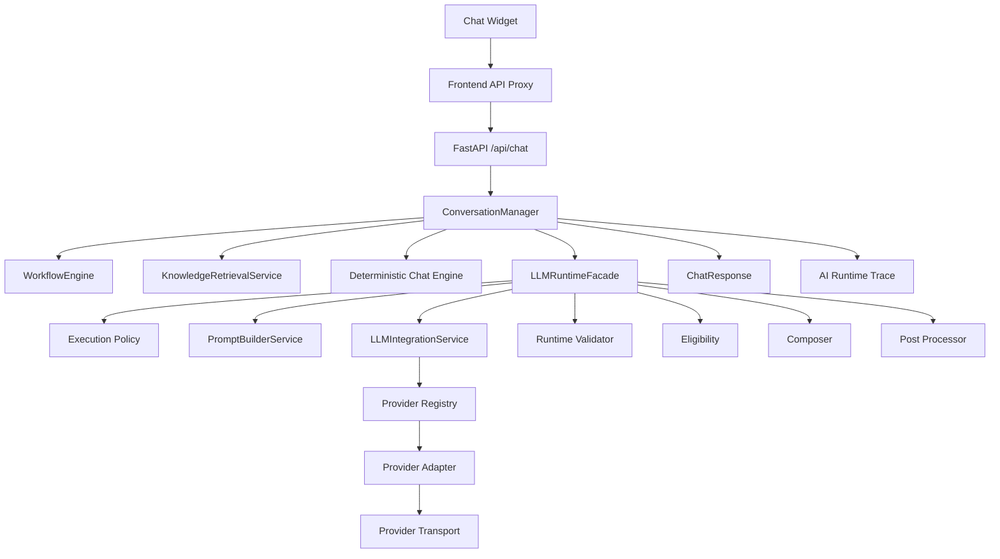
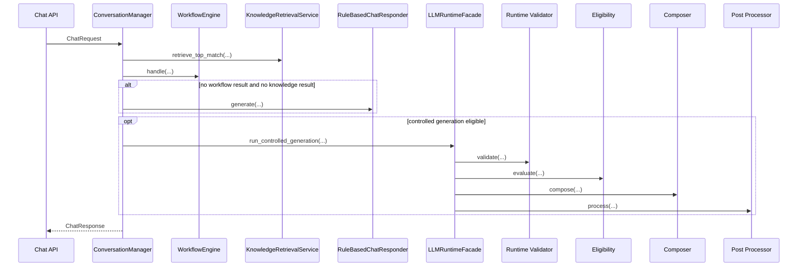
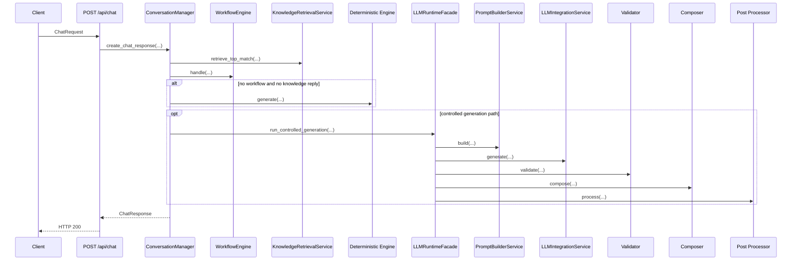

# AI Assistant API Design

Date: 2026-07-09

## 1. Purpose

This document reverse engineers the implemented AI Assistant API surface and its internal runtime contracts. It covers only the AI Assistant path, from the external chat endpoint through conversation orchestration, workflow ownership, deterministic knowledge retrieval, controlled generation, provider invocation, validation, composition, post-processing, and runtime tracing.

## 2. Scope

Included:

- AI Assistant REST endpoints under the backend chat API
- Conversation request and response contracts
- Internal contracts exchanged by `ConversationManager`, `WorkflowEngine`, Vector-less RAG, `PromptBuilderService`, `LLMRuntimeFacade`, execution policy, validator, eligibility, composer, post processor, provider adapters, provider transport, and runtime trace
- AI-triggered workflow interactions that call business services

Excluded:

- Base appointment, doctor, patient, availability, and other non-AI public APIs
- Any future or inferred endpoints not present in the repository
- Redesign proposals

## 3. Architecture Context

The AI Assistant is exposed as a backend REST API and then routed through deterministic business-first orchestration.



Implemented entry path:

- Browser-side widget calls the frontend proxy
- Frontend proxy forwards to FastAPI `/api/chat` or `/api/v1/chat`
- `backend/app/api/chat.py` delegates to `create_chat_response(...)`
- `create_chat_response(...)` constructs `ConversationManager`
- `ConversationManager.handle(...)` owns the visible response lifecycle

## 4. External REST APIs

The implementation exposes two AI Assistant REST endpoints with the same request and response contracts.

### 4.1 `POST /api/chat`

- Endpoint: `/api/chat`
- HTTP Method: `POST`
- Purpose: Primary AI Assistant endpoint for greeting, doctor-related chat, workflow-driven booking/cancellation/confirmation assistance, FAQ retrieval, and controlled low-risk generation
- Authentication: none implemented
- Request Headers:
  - `Content-Type: application/json`
- Query Parameters: none
- Request Body:
  - `message: string` required, 1-1000 chars after stripping
  - `conversation: ChatConversationRequest | null` optional
- Response Body:
  - `ChatResponse`
- Status Codes:
  - `200` success
  - `400`, `404`, `409` when expected workflow/business errors are raised as `HTTPException`
  - `422` request validation failure from FastAPI/Pydantic
  - `500` unexpected chat failure, body detail `"Chat service is unavailable."`
- Error Responses:
  - workflow/business `HTTPException` passes through unchanged
  - unexpected exception is normalized to HTTP 500
- Validation Rules:
  - `message` cannot be blank
  - `conversation.conversation_id` max 100 chars if present
  - history messages require `role` in `user|assistant|system`
  - history `text` requires 1-2000 chars
- Example Request:

```json
{
  "message": "How do I book an appointment?",
  "conversation": {
    "conversation_id": "c-123",
    "history": [
      {
        "role": "user",
        "text": "Hello"
      },
      {
        "role": "assistant",
        "text": "Hello, I am your AI Assistant."
      }
    ]
  }
}
```

- Example Response:

```json
{
  "intent": "UNKNOWN",
  "message": "# Booking Appointment Help Patients can choose a doctor, select an available date and time, provide contact details, and confirm the appointment.",
  "data": [],
  "search_filters": null,
  "help_steps": [],
  "knowledge_source": {
    "document_id": "faq.booking.general",
    "title": "Booking Appointment Help",
    "source_type": "markdown",
    "source_path": "faq/booking/general.md",
    "domain": "appointments",
    "audience": "patients",
    "status": "active",
    "matched_terms": [
      "book",
      "booking"
    ],
    "score": 170
  },
  "response": "# Booking Appointment Help Patients can choose a doctor, select an available date and time, provide contact details, and confirm the appointment.",
  "conversation": {
    "conversation_id": "c-123",
    "status": "ACTIVE",
    "turn_count": 1,
    "last_intent": "UNKNOWN",
    "active_filters": null,
    "selected_doctor_id": null,
    "selected_doctor_name": null,
    "last_user_message": "How do I book an appointment?",
    "last_assistant_message": "# Booking Appointment Help Patients can choose a doctor, select an available date and time, provide contact details, and confirm the appointment.",
    "routed_to": "FUTURE_AI_LAYER",
    "current_workflow": null
  },
  "workflow": null
}
```

### 4.2 `POST /api/v1/chat`

- Endpoint: `/api/v1/chat`
- HTTP Method: `POST`
- Purpose: Versioned alias of the primary AI Assistant endpoint
- Authentication: none implemented
- Request Headers:
  - `Content-Type: application/json`
- Query Parameters: none
- Request Body: same `ChatRequest`
- Response Body: same `ChatResponse`
- Status Codes: same as `/api/chat`
- Error Responses: same as `/api/chat`
- Validation Rules: same as `/api/chat`
- Example Request:

```json
{
  "message": "What slots does Dr. Sarah Jenkins have?"
}
```

- Example Response:

```json
{
  "intent": "SHOW_AVAILABLE_DOCTORS",
  "message": "Found 6 available slots for Dr. Sarah Jenkins on 2026-07-10.",
  "data": [
    {
      "doctor_id": 1,
      "doctor_name": "Dr. Sarah Jenkins",
      "specialty": "Cardiology",
      "available_date": "2026-07-10",
      "available_time": "08:00"
    }
  ],
  "search_filters": null,
  "help_steps": [],
  "knowledge_source": null,
  "response": "Found 6 available slots for Dr. Sarah Jenkins on 2026-07-10.",
  "conversation": {
    "conversation_id": "generated-at-runtime",
    "status": "ACTIVE",
    "turn_count": 1,
    "last_intent": "SHOW_AVAILABLE_DOCTORS",
    "active_filters": null,
    "selected_doctor_id": 1,
    "selected_doctor_name": "Dr. Sarah Jenkins",
    "last_user_message": "What slots does Dr. Sarah Jenkins have?",
    "last_assistant_message": "Found 6 available slots for Dr. Sarah Jenkins on 2026-07-10.",
    "routed_to": "DETERMINISTIC_ENGINE",
    "current_workflow": null
  },
  "workflow": null
}
```

## 5. Conversation APIs

The external REST API carries conversation state inside the `conversation` property rather than through a separate endpoint.

### 5.1 Conversation initialization

- Trigger: request omits `conversation.context`
- Contract:
  - input: `ChatConversationRequest | null`
  - output: generated `ChatConversationContext`
- Behavior:
  - generates `conversation_id` with `uuid4()` when absent
  - derives `turn_count`, prior filters, selected doctor, and last messages from history
  - initializes `status=ACTIVE`
  - initializes `routed_to=DETERMINISTIC_ENGINE`

### 5.2 Continue conversation

- Trigger: request includes prior `conversation.context` and/or `history`
- Contract:
  - input: prior `ChatConversationContext`, `history`
  - output: merged next `ChatConversationContext`
- Behavior:
  - merges current extracted filters over prior filters
  - preserves selected doctor and active workflow
  - updates `last_intent`, `last_user_message`, `last_assistant_message`
  - carries unfinished workflow through `current_workflow`

### 5.3 Session handling

- Session model: request-scoped only
- Persistence: none implemented
- Session key: `conversation_id`
- Workflow continuity: carried in `conversation.context.current_workflow`

### 5.4 History handling

- Input contract: `conversation.history: list[ChatConversationHistoryMessage]`
- Roles accepted: `user`, `assistant`, `system`
- Used for:
  - turn counting
  - recovering previous filters
  - recovering selected doctor
  - recovering last user and assistant messages

### 5.5 Context update

`ConversationManager.handle(...)` writes the final `conversation` object back into `ChatResponse` with:

- updated `turn_count`
- updated `last_intent`
- merged `active_filters`
- selected doctor resolution
- next `current_workflow`
- final `routed_to`

## 6. Runtime Processing APIs

The AI Assistant runtime is a series of internal processing contracts.



### 6.1 Conversation Manager

- Component: `ConversationManager.handle(request: ChatRequest) -> ChatResponse`
- Input Contract:
  - `ChatRequest`
- Output Contract:
  - final `ChatResponse`
- Validation:
  - depends on validated `ChatRequest`
  - internal merge utilities tolerate absent conversation/history
- Failure Conditions:
  - unexpected exceptions bubble to API layer and become HTTP 500
  - workflow-raised `HTTPException` passes through

### 6.2 Workflow Engine

- Component: `WorkflowEngine.handle(...) -> ChatResponse | None`
- Input Contract:
  - raw message
  - `ChatConversationContext`
  - `ChatSearchFilters | None`
- Output Contract:
  - `None` when no workflow owns the request
  - `ChatResponse` with `workflow` when a workflow owns the request
- Validation:
  - infers workflow type from message and current workflow
  - checks required workflow draft fields
- Failure Conditions:
  - booking service validation errors may be converted into `INPUT_REQUIRED` workflow responses
  - unhandled `HTTPException` is allowed to bubble

### 6.3 Knowledge Engine

- Component: `KnowledgeRetrievalService.retrieve_top_match(...) -> KnowledgeRetrievalMatch | None`
- Input Contract:
  - raw query string
  - optional `AIRuntimeTraceSession`
- Output Contract:
  - matched document, score, and matched terms
- Validation:
  - query tokenization
  - document scoring against title, aliases, keywords, synonyms, category, and body terms
- Failure Conditions:
  - empty query returns `None`
  - no match returns `None`
  - unexpected repository/scoring exception is re-raised

### 6.4 Prompt Builder

- Component: `PromptBuilderService.build(request: PromptBuildRequest) -> PromptBuildResult`
- Input Contract:
  - user message
  - caller-supplied conversation state
  - already-selected knowledge documents
  - active intent
  - caller system instructions
  - prompt char budget
- Output Contract:
  - rendered prompt
  - prompt blocks
  - included/excluded document ids
  - truncation flag
  - `requires_domain_validation`
- Validation:
  - `validate_context(...)` checks context section types and non-empty user message
- Failure Conditions:
  - invalid context raises `ValueError`

### 6.5 LLM Runtime

- Component: `LLMRuntimeFacade.run_controlled_generation(...) -> LLMControlledGenerationResult`
- Input Contract:
  - `LLMControlledGenerationRequest`
- Output Contract:
  - controlled-generation result with decision, status, stage results, and optional final response
- Validation:
  - execution policy approval
  - runtime response validator
  - runtime response eligibility evaluator
- Failure Conditions:
  - policy can skip execution
  - orchestration can fail
  - validation can fail
  - eligibility can reject visibility
  - composition/post-processing can fall back

### 6.6 Composer

- Component: `LLMRuntimeResponseComposer.compose(...) -> LLMRuntimeResponseComposerResult`
- Input Contract:
  - composition mode
  - optional deterministic response
  - optional validated eligible orchestration result
- Output Contract:
  - provider-neutral final runtime response envelope plus diagnostics
- Validation:
  - supported modes only: `DETERMINISTIC_ONLY`, `LLM_ONLY`, `HYBRID`
- Failure Conditions:
  - unsupported mode
  - missing deterministic response for deterministic-only fallback
  - unavailable usable LLM result

### 6.7 Post Processor

- Component: `LLMRuntimeResponsePostProcessor.process(...) -> LLMRuntimeResponsePostProcessingResult`
- Input Contract:
  - final runtime response
  - optional composition result
- Output Contract:
  - normalized final response plus diagnostics
- Validation:
  - requires final response envelope
- Failure Conditions:
  - missing final response yields `FALLBACK`

## 7. Workflow APIs

These are internal workflow interactions, not separate REST endpoints.

### 7.1 Workflow selection

- Implemented by `_resolve_workflow_type(...)`
- Supported workflow types:
  - `BOOK_APPOINTMENT`
  - `CANCEL_APPOINTMENT`
  - `APPOINTMENT_CONFIRMATION`
- Inputs:
  - current message
  - current workflow state
  - conversation context
- Selection rules:
  - active workflow generally retains ownership
  - explicit switch keywords can release ownership
  - booking/cancellation/confirmation keywords can start or switch workflows

### 7.2 Workflow execution

- Executor: `WorkflowEngine.handle(...)`
- Execution models:
  - input collection only
  - deterministic business call
  - completion response

### 7.3 Workflow completion

- Completion status: `ChatWorkflowStatus.COMPLETED`
- Completion artifact: `ChatWorkflowResult.appointment`
- Visible response remains deterministic and business-owned

### 7.4 Workflow interruption

- Implicit interruption exists through switch keywords:
  - `start over`
  - `switch`
  - `something else`
  - `different question`
- No separate interruption endpoint exists

### 7.5 Workflow continuation

- Current workflow state is stored in `conversation.current_workflow`
- Follow-up turns reuse and merge the workflow draft

### 7.6 Business API invocation by workflows

The workflows call business services directly:

- booking:
  - `create_appointment_booking(...)`
  - `get_appointment_confirmation_by_reference(...)`
- cancellation:
  - `cancel_appointment_booking(...)`
- confirmation lookup:
  - `get_appointment_confirmation_by_reference(...)`

The AI Assistant does not expose these business services as separate AI APIs.

## 8. Knowledge APIs

### 8.1 Knowledge lookup

- Component: `KnowledgeRetrievalService.retrieve_top_match(query, runtime_trace=None)`
- Purpose: deterministic single-best-document retrieval over local knowledge corpus

### 8.2 Knowledge search

- Search model: token and phrase scoring
- Sources:
  - document title
  - aliases
  - keywords
  - synonyms
  - category
  - summary/body/tags

### 8.3 Knowledge retrieval

- Output model: `KnowledgeRetrievalMatch`
  - `document`
  - `score`
  - `matched_terms`

### 8.4 Knowledge ranking

- Ranking logic:
  - title phrase: 120
  - alias phrase: 140
  - keyword phrase: 100
  - synonym phrase: 80
  - category phrase: 40
  - title term overlap: 50 each
  - alias term overlap: 45 each
  - keyword term overlap: 30 each
  - synonym term overlap: 20 each
  - category term overlap: 10 each
  - body term overlap: 5 each
- Tie-breakers:
  - higher score
  - higher document priority
  - lower document id lexical order

### 8.5 Knowledge formatting

- Visible response formatting for deterministic knowledge path is done by `ConversationManager` through `_knowledge_document_message(...)`
- Output can come from:
  - `can_help_with` list in document content
  - quote-safe raw content
  - document summary
  - document title

### 8.6 Knowledge response generation

- Visible response model:
  - `ChatResponse.intent=UNKNOWN`
  - `message` from `_knowledge_document_message(...)`
  - `knowledge_source` from `_knowledge_source_from_match(...)`

### 8.7 Routing logic

- Knowledge is skipped when an active workflow exists
- Knowledge is used only when:
  - no active workflow
  - retrieval found a match
  - `_should_use_knowledge_response(intent_match)` returns true
- Current visible knowledge path does not invoke Prompt Builder

## 9. Prompt Builder APIs

### 9.1 Entry API

- `PromptBuilderService.build(request: PromptBuildRequest) -> PromptBuildResult`
- `PromptBuilderService.build_context(request: PromptBuildRequest) -> PromptContext`
- `PromptBuilderService.validate_context(context: PromptContext) -> PromptContextValidationResult`

### 9.2 Conversation Context

- `PromptContextConversationCollector.collect(...) -> PromptContextConversationContext | None`
- Extracts:
  - raw state
  - current user message
  - normalized previous turns
  - assistant turns
  - conversation metadata

### 9.3 Workflow Context

- `PromptContextWorkflowCollector.collect(...) -> PromptContextWorkflowContext | None`
- Extracts:
  - active intent
  - workflow status
  - collected fields
  - missing fields
  - workflow metadata/state

### 9.4 Knowledge Context

- `PromptContextKnowledgeCollector.collect(...) -> PromptContextKnowledgeCollection`
- Extracts:
  - included documents
  - excluded documents
  - `requires_domain_validation`

### 9.5 Runtime Context

There is no separate type literally named `RuntimeContext` in the prompt-builder module. The runtime input is represented by:

- `PromptBuildRequest`
- `PromptContext`
- `PromptContextMetadata`
- `PromptContextSystemInstructions`
- `PromptContextConstraints`
- `PromptContextRenderingOptions`

### 9.6 Prompt Assembly

- `PromptContextAssemblyPipeline.assemble(context: PromptContext) -> list[PromptAssemblySection]`

### 9.7 Prompt Output

- `PromptRenderer.render(...) -> PromptRenderResult`
- final service output: `PromptBuildResult`

## 10. Controlled Generation APIs

### 10.1 Eligibility evaluation

- Component: `LLMRuntimeResponseEligibilityEvaluator.evaluate(...)`
- Input: `LLMRuntimeResponseEligibilityRequest`
- Output: `LLMRuntimeResponseEligibilityResult`

### 10.2 Execution policy

- Component: `AIExecutionPolicyService.evaluate(...)`
- Input: `AIExecutionPolicyRequest`
- Output: `AIExecutionDecision`

### 10.3 Generation decision

`ConversationManager` creates `AIExecutionPolicyRequest` using:

- preferred mode:
  - `HYBRID` when knowledge baseline exists
  - `LLM_ONLY` otherwise
- `intent_name`
- `has_active_workflow=False`
- `knowledge_eligible`
- `knowledge_match_available`

### 10.4 Routing decision

`LLMRuntimeFacade.run_controlled_generation(...)` either:

- preserves deterministic response
- executes `LLM_ONLY`
- executes `HYBRID`
- skips with fallback reason

### 10.5 Fallback

Fallback can occur at:

- execution policy
- orchestration
- validation
- eligibility
- composition
- post-processing

## 11. LLM Runtime APIs

### 11.1 Provider Registry

- Implementation: `InMemoryLLMProviderRegistry`
- Consumed by: `LLMIntegrationService`
- Registry functions used:
  - `list_providers()`
  - `get_provider(provider_name)`
  - `get_default_provider_name()`

### 11.2 Provider Adapter

- Base: `ConfigurableLLMProviderAdapter`
- Concrete adapters:
  - `OpenAIProviderAdapter`
  - `ClaudeProviderAdapter`
  - `GeminiProviderAdapter`
  - `OpenRouterProviderAdapter`
  - `OllamaProviderAdapter`

### 11.3 Provider Transport

- Transport protocol: `LLMProviderTransport.invoke(request: ProviderPayload) -> ProviderPayload`
- Production transport implemented:
  - `ClaudeTransport`

### 11.4 Provider Request

Canonical provider invocation begins with `LLMGenerationRequest` and is translated by adapters into `ProviderPayload`.

Concrete Claude transport request fields currently emitted to Anthropic include:

- `model`
- `messages`
- `max_tokens`
- optional `metadata.user_id`
- optional `system`
- optional `temperature`
- optional `top_p`
- optional `stop_sequences`
- optional `thinking`
- optional `tools`
- optional `tool_choice`

### 11.5 Provider Response

Transport translates provider-native payload back into provider-neutral `LLMGenerationResponse`.

### 11.6 Provider Errors

- Normalized transport error type: `LLMTransportError`
- Fields:
  - `provider_name`
  - `error_code`
  - `status_code`
  - `request_id`
  - `retryable`
  - `metadata`

### 11.7 Retry

- Configured per provider in `LLMProviderConfiguration`
  - `max_retries`
  - `retry_backoff_seconds`
- Claude runtime client passes `max_retries` into Anthropic SDK client construction
- No additional application-level retry loop is implemented in `ClaudeTransport.invoke(...)`

### 11.8 Timeout

- Configured per provider in `LLMProviderConfiguration.timeout_seconds`
- Claude runtime client passes `timeout_seconds` into Anthropic SDK client construction

## 12. Runtime Validation APIs

### 12.1 Validation

- Component: `LLMRuntimeResponseValidator`
- Entry: `validate(request: LLMRuntimeResponseValidationRequest)`

### 12.2 Safety and structural gates

Validator checks:

- rendered prompt exists
- `response_message` exists
- assistant role is canonical `LLMMessageRole.ASSISTANT`
- response content is non-empty and not whitespace-only
- `finish_reason` is canonical
- structured output is present when requested
- structured output is a mapping when present

### 12.3 Eligibility linkage

- Eligibility is a separate stage and depends on `validation_result.is_valid`

### 12.4 Response verification output

- Output: `LLMRuntimeResponseValidationResult`
- Status values:
  - `VALID`
  - `INVALID`

## 13. Composer APIs

### 13.1 Response composition

- Component: `LLMRuntimeResponseComposer.compose(...)`
- Request: `LLMRuntimeResponseComposerRequest`
- Result: `LLMRuntimeResponseComposerResult`

### 13.2 Formatting

Composition output is a provider-neutral `LLMRuntimeResponse`:

- `message`
- `data`
- `metadata`

### 13.3 Citation attachment

- Citations are carried from orchestration result into LLM response metadata and final response metadata during composition

### 13.4 Metadata enrichment

Composer diagnostics and final metadata include:

- provider/model information
- composition mode
- augmentation flags
- fallback reason when applicable
- preserved business field names

## 14. Post Processor APIs

### 14.1 Cleanup

- trailing space removal
- duplicate blank-line collapse
- metadata sanitization for presentation-only keys

### 14.2 Formatting

- heading markdown normalization
- bullet normalization
- ordered-list normalization
- blockquote normalization

### 14.3 Normalization

- newline normalization
- leading/trailing trim

### 14.4 Final output generation

- output type: `LLMRuntimeResponsePostProcessingResult`
- statuses:
  - `PROCESSED`
  - `FALLBACK`

## 15. Runtime Trace APIs

### 15.1 Trace generation

- Component: `AIRuntimeTraceSession`
- Created by: `ConversationManager.handle(...)`
- Registered through: `AIRuntimeTraceRegistry.register(...)`

### 15.2 Logging

- Sink logger: `ai.runtime.trace`
- File: `logs/ai-runtime-trace.log`
- Emit point: exactly once from `ConversationManager` `finally` block

### 15.3 Metrics and diagnostics

Captured roots include:

- `trace_id`
- `request_id`
- `conversation_id`
- `intent`
- `execution_mode`
- `selected_provider`
- `provider_health`
- `final_response_source`
- `latency_ms`
- exception details

Captured stages include:

- `conversation_manager`
- `workflow_engine`
- `vectorless_rag`
- `execution_policy`
- `runtime_facade`
- `prompt_builder`
- `llm_integration`
- `provider_adapter`
- `provider_transport`
- `runtime_validator`
- `eligibility`
- `composer`
- `post_processor`
- `final_response`

## 16. Routing Decision Matrix

| Request Shape | Conversation Manager Route | Workflow | Knowledge | Prompt Builder | LLM Runtime | Visible Response Source |
|---|---|---|---|---|---|---|
| Greeting | deterministic | no | no | no | no | deterministic chat engine |
| Doctor list / availability / doctor details | deterministic | no | no | no | no | deterministic chat engine |
| Booking / cancellation / confirmation | workflow-first | yes | no | no for visible path | no for visible path | workflow engine |
| FAQ / appointment help with knowledge hit | knowledge-first | no | yes | no for visible deterministic knowledge path | optional controlled generation only if eligible path is later invoked | knowledge response or controlled generation fallback |
| Unknown low-risk conversational request | deterministic baseline | no | maybe | yes when controlled generation executes | yes when activation and policy allow | controlled generation or deterministic fallback |
| Active workflow continuation | workflow-only | yes | skipped | no | no | workflow engine |
| Policy/activation not generation-ready | baseline fallback | maybe | maybe | no | no | deterministic or knowledge baseline |

## 17. Internal Runtime Contracts

Only implemented models are listed here.

### 17.1 External and conversation contracts

- `ChatRequest`
- `ChatResponse`
- `ChatConversationRequest`
- `ChatConversationContext`
- `ChatConversationHistoryMessage`
- `ChatSearchFilters`
- `ChatKnowledgeSource`
- `ChatWorkflowState`
- `ChatWorkflowResult`
- `ChatWorkflowDraft`
- `ChatWorkflowAppointmentSummary`

### 17.2 Knowledge contracts

- `KnowledgeDocument`
- `KnowledgeRetrievalMatch`

### 17.3 Prompt contracts

- `PromptBuildRequest`
- `PromptBuildResult`
- `PromptContext`
- `PromptContextMetadata`
- `PromptContextUserContext`
- `PromptContextConversationContext`
- `PromptContextConversationTurn`
- `PromptContextWorkflowContext`
- `PromptContextKnowledgeContext`
- `PromptContextKnowledgeDocument`
- `PromptContextKnowledgeCollection`
- `PromptContextSystemInstructions`
- `PromptContextConstraints`
- `PromptContextRenderingOptions`
- `PromptContextValidationIssue`
- `PromptContextValidationResult`
- `PromptAssemblySection`
- `PromptRenderResult`
- `PromptContextBlock`

### 17.4 LLM orchestration contracts

- `LLMGenerationOrchestrationRequest`
- `LLMGenerationOrchestrationResult`
- `LLMGenerationRequest`
- `LLMGenerationResponse`
- `LLMMessage`
- `LLMTokenUsage`
- `LLMCitation`
- `LLMToolDefinition`
- `LLMToolChoice`
- `LLMToolCall`
- `LLMReasoningConfig`
- `LLMReasoningResult`
- `LLMStreamingOptions`
- `LLMStreamingMetadata`
- `LLMStructuredOutputSchema`
- `LLMGenerationConstraints`

### 17.5 Execution policy and controlled generation contracts

- `AIExecutionPolicyRequest`
- `AIExecutionDecision`
- `AIExecutionActivationSnapshot`
- `AIExecutionDiagnostic`
- `LLMShadowModeRequest`
- `LLMShadowModeDispatchResult`
- `LLMShadowModeDiagnostic`
- `LLMControlledGenerationRequest`
- `LLMControlledGenerationResult`

### 17.6 Validation, eligibility, composition, and post-processing contracts

- `LLMRuntimeResponseValidationRequest`
- `LLMRuntimeResponseValidationResult`
- `LLMRuntimeResponseValidationIssue`
- `LLMRuntimeResponseEligibilityRequest`
- `LLMRuntimeResponseEligibilityResult`
- `LLMRuntimeResponseEligibilityIssue`
- `LLMRuntimeResponse`
- `LLMRuntimeResponseComposerRequest`
- `LLMRuntimeResponseComposerResult`
- `LLMRuntimeResponseCompositionIssue`
- `LLMRuntimeResponsePostProcessingRequest`
- `LLMRuntimeResponsePostProcessingResult`
- `LLMRuntimeResponsePostProcessingIssue`

### 17.7 Runtime trace contracts

- `AIRuntimeTraceSession`
- emitted JSON payload from `AIRuntimeTraceSession.emit()`

## 18. Error Handling

### 18.1 Validation errors

- HTTP request validation errors return `422`
- booking workflow input/service validation can be converted into `INPUT_REQUIRED` workflow replies
- runtime generation validation failures produce controlled-generation failure/fallback, not user-visible provider output

### 18.2 Provider failures

- adapter with no transport raises runtime error
- Claude transport maps provider errors to `LLMTransportError`
- controlled generation catches exceptions and preserves deterministic response

### 18.3 Knowledge failures

- no match returns `None`
- runtime exceptions are traced and re-raised to caller

### 18.4 Workflow failures

- expected booking validation failures are mapped back into workflow guidance where implemented
- other `HTTPException` values bubble to the API layer

### 18.5 Timeouts

- provider timeout is configured in provider configuration and enforced by SDK client setup

### 18.6 Retries

- retry count is configured at provider client construction
- no generic application retry loop exists above the provider SDK

### 18.7 Fallback responses

Fallback behavior is explicit at multiple levels:

- execution policy fallback to workflow/knowledge/deterministic baseline
- validation fallback to existing deterministic response
- eligibility fallback to existing deterministic response
- composition fallback between deterministic-only, hybrid, and LLM-only outcomes
- post-processing fallback when final response is missing

## 19. Sequence Mapping

### 19.1 Chat REST API to runtime stages



### 19.2 Sequence notes

- Workflow-owned requests do not expose Prompt Builder or LLM output to the user
- Deterministic visible knowledge responses are produced directly by `ConversationManager`
- Prompt Builder participates only inside shadow or controlled generation orchestration

## 20. Production Considerations

### 20.1 Performance

- knowledge retrieval is in-memory over loaded local documents
- prompt size is bounded by `max_prompt_chars`
- controlled generation adds extra runtime stages only for eligible requests

### 20.2 Scalability

- conversation state is request-scoped and client-carried, which avoids server-side session storage but shifts size management to request payloads
- knowledge corpus is currently repository-local and memory-backed

### 20.3 Caching

- knowledge retrieval service is cached via `@lru_cache(maxsize=1)`
- runtime facade is cached via `@lru_cache(maxsize=1)`
- composition root caches the built LLM composition graph in-memory

### 20.4 Idempotency

- chat endpoints are not idempotent in the strict REST sense because workflow-owned turns may create bookings or cancel them
- booking completion remains guarded by business-service validations

### 20.5 Concurrency

- request handling is stateless apart from database operations and trace emission
- shadow execution can run asynchronously in a daemon thread
- trace session and registry use locks

### 20.6 Timeouts

- provider timeout is configured per provider
- no separate orchestration-level timeout wrapper is implemented

### 20.7 Security

- no chat authentication layer is implemented
- runtime trace redacts common patient PII patterns before logging user message text
- Claude outbound metadata serializer strips unsupported internal runtime metadata

### 20.8 Observability

- runtime-trace file logging is available behind `AI_RUNTIME_TRACE=true`
- trace records include stage-level status, duration, stop reason, and exception data

### 20.9 Tracing

- exactly one final trace emission per request is enforced by `AIRuntimeTraceSession.emit()`
- skipped LLM paths explicitly record `llm_not_invoked`, stop component, and stop reason

### 20.10 Configuration

- runtime flags:
  - `enabled`
  - `shadow_mode`
  - `allow_generation`
  - `allow_streaming`
  - `allow_tool_calling`
  - `allow_reasoning`
- provider configuration includes:
  - `enabled`
  - `default_model_name`
  - `api_key`
  - `base_url`
  - `timeout_seconds`
  - `max_retries`
  - `retry_backoff_seconds`

### 20.11 Versioning

- REST API currently exposes unversioned `/api/chat` and versioned alias `/api/v1/chat`
- internal runtime contracts are versionless code models and evolve through implementation changes rather than explicit API version negotiation
