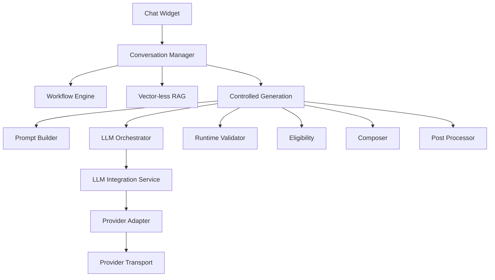
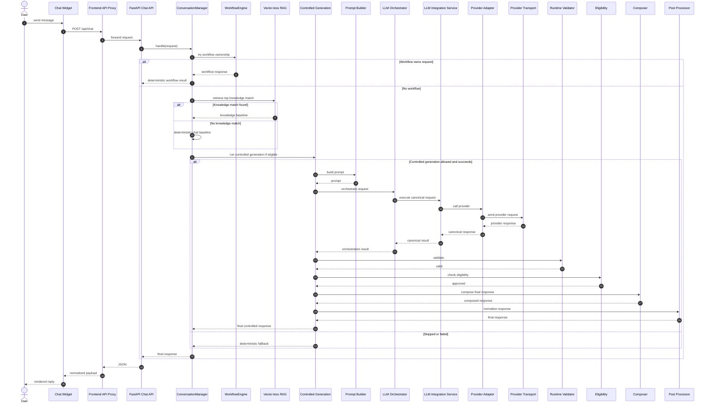
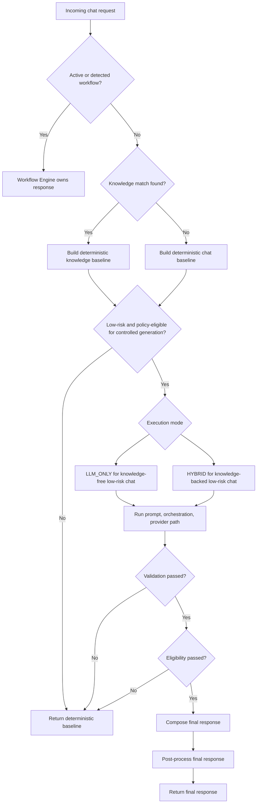

# AI Assistant Final Implementation Summary

Date: 2026-07-09

## 1. Executive Summary

The implemented AI Assistant is a business-safe, backend-orchestrated chat runtime layered on top of the doctor appointment platform. It combines a globally mounted Next.js chat widget, a FastAPI chat API, request-scoped conversation orchestration, deterministic workflow execution, local vector-less knowledge retrieval, a provider-neutral prompt and LLM runtime seam, guarded controlled generation, and request-scoped runtime tracing.

It exists to provide conversational assistance without surrendering business-critical ownership to a model. The current implementation is beyond a prototype: the widget, conversation flow, workflow engine, FAQ retrieval, controlled generation path, provider abstraction, Claude-backed transport, validation, eligibility gating, response composition, post-processing, and runtime trace stack are all present in code and backed by focused tests. The overall capability set is hybrid by design: workflow and business actions remain deterministic, low-risk conversational responses may use controlled generation, and all visible responses pass through an explicit orchestration boundary.

## 2. Project Goal

### Business objective

The business objective is to give users a single conversational assistant that can help with appointment-related questions, guide booking and cancellation workflows, surface doctor and scheduling information through the existing application services, and answer common informational questions from curated knowledge sources.

### Technical objective

The technical objective is to implement an AI runtime that is safe, testable, provider-neutral, observable, and reusable. The system is designed so that conversation routing, workflow execution, retrieval, prompting, provider invocation, validation, and final response assembly are independently owned seams rather than one opaque chatbot block.

### Architecture philosophy

The implemented philosophy is deterministic-first and AI-augmented second:

- business workflows own critical actions
- curated knowledge owns FAQ-style truth
- LLM generation is allowed only behind policy, validation, and eligibility gates
- the repository implementation is authoritative over architecture documents

### Production goals

The current code targets production-safe behavior through explicit routing, bounded feature flags, provider-neutral contracts, normalized transport errors, additive runtime tracing, and test-backed fallback behavior. It does not implement a persistent conversation store, authentication-specific AI controls, or autonomous business execution outside the workflow layer.

## 3. Final Runtime Architecture

Implemented interpretation:

- `Chat Widget` is the reusable frontend package mounted by `GlobalAiWidget`.
- `Conversation Manager` is `backend/app/services/conversation_manager.py`.
- `Workflow Engine` is the deterministic workflow owner for booking, cancellation, and confirmation.
- `Vector-less RAG` is the local knowledge repository and deterministic retrieval layer.
- `Controlled Generation` is the visible guarded LLM path exposed through `LLMRuntimeFacade`.
- `Prompt Builder`, `LLM Orchestrator`, `LLM Integration Service`, `Provider Adapter`, and `Provider Transport` are reusable backend seams.
- `Runtime Validator`, `Eligibility`, `Composer`, and `Post Processor` decide whether and how model output can reach the user.

## 4. AI Assistant Implementation Journey

The implementation started as a frontend chat widget and a deterministic backend conversation layer. It then gained workflow ownership so booking-related interactions could stay structured and business-safe. After that, the runtime added local vector-less knowledge retrieval for FAQ-style answers without requiring embeddings or a vector database.

The next expansion built a provider-neutral internal AI platform: Prompt Builder, orchestrator, integration service, provider contracts, provider configuration, execution policy, activation, operational readiness, adapters, and transport. That platform was initially disconnected or shadow-only. The final major step moved selected low-risk requests into controlled user-visible generation while preserving deterministic ownership for workflows, doctor search, availability lookup, and other business-led routes. The runtime trace layer then matured into a durable, exact-once request diagnostic path with file-backed JSON logs.

## 5. Phase-wise Implementation Summary

### Phase 1: Chat Widget

- Purpose: provide the user-facing AI assistant entrypoint in the frontend.
- Responsibilities: mount globally, collect messages, call the frontend proxy, map backend responses, render text and structured cards, and hand completed chat bookings into the existing booking store.
- Major Components: `frontend/components/layout/GlobalAiWidget.tsx`, `frontend/lib/ai-widget/components/*`, `frontend/lib/ai-widget/core/*`, `frontend/lib/ai-widget/services/api-service.ts`, `frontend/lib/ai-widget/services/chat-response-mapper.ts`.
- Inputs: user message text, prior widget message history, backend chat responses.
- Outputs: rendered assistant messages, workflow metadata, knowledge-source footer, booking redirect side effects.
- Dependencies: frontend proxy route, mirrored chat DTOs, booking store.
- Runtime Position: frontend runtime entrypoint.
- Enterprise Benefits: reusable widget package with app-specific integration only at the shell edge.
- Implementation Status: implemented and live.
- Production Considerations: state is local/request-carried; no independent widget persistence layer exists.

### Phase 2: Conversation Manager

- Purpose: own the visible backend response lifecycle for every chat turn.
- Responsibilities: rebuild conversation context, extract intent and entities, preserve active workflow continuity, orchestrate workflow-first routing, knowledge routing, deterministic fallback, controlled generation triggering, and final trace emission.
- Major Components: `backend/app/services/conversation_manager.py`, `chat_intent_detector.py`, `chat_entity_extractor.py`.
- Inputs: `ChatRequest`, database session, prior conversation metadata.
- Outputs: final `ChatResponse` with updated conversation context and optional workflow or knowledge metadata.
- Dependencies: workflow engine, retrieval service, deterministic chat service, runtime facade, runtime trace.
- Runtime Position: primary backend controller.
- Enterprise Benefits: single orchestration boundary with explicit ownership rules.
- Implementation Status: implemented and live.
- Production Considerations: conversation state is request-scoped and client-carried rather than persisted server-side.

### Phase 3: Workflow Engine

- Purpose: keep business-critical AI actions deterministic.
- Responsibilities: detect workflow ownership, merge draft state across turns, request missing fields, call booking/cancellation/confirmation services, and return structured workflow responses.
- Major Components: `backend/app/services/workflow_engine.py`.
- Inputs: user message, conversation context, extracted entities/filters.
- Outputs: workflow-owned `ChatResponse` or `None`.
- Dependencies: appointment business services and database-backed application state.
- Runtime Position: first backend decision owner after conversation shaping.
- Enterprise Benefits: prevents booking actions from being delegated to free-form generation.
- Implementation Status: implemented and live.
- Production Considerations: workflow-owned turns intentionally bypass visible LLM generation.

### Phase 4: Vector-less RAG

- Purpose: answer FAQ-style and assistant-capability questions from curated local knowledge.
- Responsibilities: load Markdown and JSON knowledge documents, store them in memory, rank candidate matches deterministically, and return source metadata with the selected answer.
- Major Components: `backend/app/knowledge/documents.py`, `loader.py`, `repository.py`, `retrieval.py`, `sources/`.
- Inputs: current user message, loaded repository documents.
- Outputs: `KnowledgeRetrievalMatch` or no match.
- Dependencies: repository-local source files and `ConversationManager`.
- Runtime Position: non-workflow informational branch before deterministic fallback.
- Enterprise Benefits: low-cost, auditable knowledge path without external retrieval infrastructure.
- Implementation Status: implemented and live.
- Production Considerations: retrieval is deterministic and local; Prompt Builder is not used on the visible retrieval-only path unless controlled generation later uses the knowledge result as hybrid context.

### Phase 5: Controlled Generation

- Purpose: expose model-backed responses only for explicitly allowed low-risk turns.
- Responsibilities: build controlled-generation requests, choose `LLM_ONLY` or `HYBRID` mode, preserve deterministic fallback on skip/failure, and replace or augment the baseline response only after downstream checks succeed.
- Major Components: `backend/app/llm/facade.py`, `backend/app/services/conversation_manager.py`.
- Inputs: baseline deterministic or knowledge response, conversation context, optional knowledge match, execution-policy inputs.
- Outputs: controlled-generation result with success, skip, or failure state and optional final visible response.
- Dependencies: activation, policy, orchestrator, validator, eligibility, composer, post processor, trace.
- Runtime Position: guarded backend augmentation layer after baseline ownership is known.
- Enterprise Benefits: controlled use of LLM capability without changing business truth ownership.
- Implementation Status: implemented and live for eligible low-risk requests.
- Production Considerations: workflow-owned and other blocked routes remain deterministic.

### Phase 6: Prompt Builder

- Purpose: create deterministic provider-neutral prompt payloads from runtime context.
- Responsibilities: collect conversation context, workflow context, and knowledge context; build system instructions; validate prompt inputs; assemble ordered prompt sections; render final prompt text.
- Major Components: `backend/app/services/prompt_builder.py`.
- Inputs: provider-neutral generation request context from the orchestrator/facade path.
- Outputs: rendered prompt plus deterministic build diagnostics.
- Dependencies: canonical prompt context models and runtime-supplied metadata.
- Runtime Position: inside controlled-generation orchestration, not in the baseline deterministic chat path.
- Enterprise Benefits: separates prompt construction from transport and orchestration concerns.
- Implementation Status: implemented and live within the controlled-generation path.
- Production Considerations: prompt logic is deterministic and testable; it does not own retrieval or workflow execution.

### Phase 7: LLM Orchestrator

- Purpose: transform already-collected runtime context into a provider-neutral generation call.
- Responsibilities: invoke Prompt Builder, build canonical generation requests, delegate to the integration service, and normalize orchestration results for the facade.
- Major Components: `backend/app/llm/orchestrator.py`.
- Inputs: controlled-generation request, prompt-build inputs, provider/runtime options.
- Outputs: normalized orchestration result.
- Dependencies: Prompt Builder and LLM Integration Service.
- Runtime Position: first LLM-runtime stage after policy approval.
- Enterprise Benefits: keeps request shaping and downstream invocation separate from route logic.
- Implementation Status: implemented and live for controlled generation.
- Production Considerations: orchestration remains provider-neutral and does not expose provider-native details to callers.

### Phase 8: LLM Integration Service

- Purpose: act as the provider-neutral execution boundary over adapters and registry resolution.
- Responsibilities: resolve the target provider, delegate canonical request execution, and return canonical response models.
- Major Components: `backend/app/llm/service.py`, `backend/app/llm/registry.py`, `backend/app/llm/interfaces.py`, `backend/app/llm/models.py`.
- Inputs: canonical `LLMGenerationRequest`.
- Outputs: canonical `LLMGenerationResponse`.
- Dependencies: runtime registry, provider adapters, canonical models.
- Runtime Position: central provider-neutral dispatch layer.
- Enterprise Benefits: isolates orchestration from concrete provider code.
- Implementation Status: implemented and live when controlled generation reaches provider execution.
- Production Considerations: inactive or misconfigured providers degrade safely through facade fallback behavior.

### Phase 9: Provider Adapter

- Purpose: translate provider-neutral request and response models to provider-specific transport contracts.
- Responsibilities: map canonical request fields, enforce adapter-level provider capabilities, normalize provider responses, and capture adapter diagnostics.
- Major Components: `backend/app/llm/adapters.py`, `backend/app/llm/providers.py`.
- Inputs: canonical generation request and transport response.
- Outputs: provider-normalized canonical response.
- Dependencies: provider transport and provider configuration.
- Runtime Position: bridge between integration service and transport.
- Enterprise Benefits: enables multi-provider extension without changing callers.
- Implementation Status: implemented; Claude-backed execution is live, others remain composition-capable seams.
- Production Considerations: adapters remain strict about canonical boundaries and transport presence.

### Phase 10: Provider Transport

- Purpose: own real SDK/network communication with the provider.
- Responsibilities: serialize provider-native payloads, invoke the provider SDK, normalize provider errors, extract request/response identifiers and usage, and stamp transport trace diagnostics.
- Major Components: `backend/app/llm/transport.py`.
- Inputs: adapter-translated provider request.
- Outputs: transport-normalized provider response or transport error.
- Dependencies: Anthropic SDK for the implemented Claude transport and runtime configuration.
- Runtime Position: external provider boundary.
- Enterprise Benefits: explicit network seam with auditable serialization and error handling.
- Implementation Status: implemented; Claude transport is production-backed.
- Production Considerations: unsupported internal metadata is stripped before outbound Anthropic requests.

### Phase 11: Runtime Validator

- Purpose: reject malformed or unsafe canonical model output before it can become user-visible.
- Responsibilities: validate response shape, reject blank output, reject malformed structured data, check finish reasons, and emit deterministic diagnostics.
- Major Components: `backend/app/llm/validation.py`.
- Inputs: canonical LLM generation result.
- Outputs: validation decision and diagnostics.
- Dependencies: facade-controlled generation flow.
- Runtime Position: post-generation, pre-eligibility.
- Enterprise Benefits: creates a stable quality gate between provider output and business-visible response assembly.
- Implementation Status: implemented and live.
- Production Considerations: validation failures fall back safely to the deterministic baseline.

### Phase 12: Eligibility

- Purpose: ensure only explicitly approved response classes can use visible LLM output.
- Responsibilities: allow low-risk conversational augmentation, reject workflow-owned or disallowed categories, and preserve deterministic fallback.
- Major Components: `backend/app/llm/eligibility.py`.
- Inputs: validated orchestration result and execution metadata.
- Outputs: eligibility decision and diagnostics.
- Dependencies: validator, execution metadata, facade.
- Runtime Position: post-validation, pre-composition.
- Enterprise Benefits: separates response safety policy from generation success.
- Implementation Status: implemented and live.
- Production Considerations: rejected responses do not surface model output.

### Phase 13: Composer

- Purpose: assemble the final visible runtime response from deterministic business truth and optional eligible model output.
- Responsibilities: support deterministic-only, LLM-only, and hybrid composition modes; preserve business fields; place augmentation text consistently.
- Major Components: `backend/app/llm/composer.py`.
- Inputs: baseline response, eligible LLM output, execution mode.
- Outputs: canonical final response before presentation cleanup.
- Dependencies: facade, validation, eligibility.
- Runtime Position: final response assembly stage.
- Enterprise Benefits: allows augmentation without losing business-owned payload integrity.
- Implementation Status: implemented and live.
- Production Considerations: hybrid mode is used when knowledge-backed answers are augmented.

### Phase 14: Post Processor

- Purpose: normalize the final response for presentation.
- Responsibilities: clean whitespace, normalize markdown/newlines, sanitize presentation-only metadata, and return the final user-facing payload.
- Major Components: `backend/app/llm/post_processor.py`.
- Inputs: composed runtime response.
- Outputs: final normalized response.
- Dependencies: composer and facade.
- Runtime Position: last stage before the final `ChatResponse` returns to the frontend.
- Enterprise Benefits: presentation cleanup is isolated from business and provider logic.
- Implementation Status: implemented and live.
- Production Considerations: this stage does not change business truth or routing ownership.

## 6. Runtime Request Lifecycle

## 7. Runtime Decision Flow

## 8. Major Runtime Components

### Chat Widget

- Purpose: frontend interaction surface for the assistant.
- Responsibilities: local widget state, message dispatch, response rendering, booking redirect handoff.
- Key classes/files: `GlobalAiWidget`, `AiWidgetRoot`, `AiWidgetProvider`, `api-service.ts`, `chat-response-mapper.ts`.
- Dependencies: frontend proxy, mirrored chat DTOs, booking store.
- Used by: application shell.
- Calls: frontend proxy route and navigation/booking helpers.
- Configuration: frontend runtime base URL via proxy behavior.
- Extension points: alternate adapters, alternate services, UI rendering variants.

### Conversation Manager

- Purpose: backend runtime orchestrator.
- Responsibilities: conversation reconstruction, routing, baseline response ownership, controlled-generation triggering, final trace emission.
- Key classes/files: `ConversationManager`.
- Dependencies: workflow engine, knowledge retrieval, chat service, runtime facade, runtime trace.
- Used by: chat API handler.
- Calls: workflow, retrieval, deterministic responder, facade.
- Configuration: backend settings and runtime trace flag.
- Extension points: new routing policies and additional deterministic owners.

### Workflow Engine

- Purpose: deterministic execution of structured AI-assisted business flows.
- Responsibilities: workflow detection, draft merge, business-service delegation, completion/fallback.
- Key classes/files: `WorkflowEngine`.
- Dependencies: appointment service layer and DB session.
- Used by: `ConversationManager`.
- Calls: booking, cancellation, confirmation service functions.
- Configuration: inherited business/service configuration.
- Extension points: additional workflows with deterministic ownership.

### Vector-less RAG

- Purpose: deterministic curated knowledge retrieval.
- Responsibilities: knowledge loading, in-memory storage, scoring, match selection, source metadata return.
- Key classes/files: `KnowledgeDocument`, `InMemoryKnowledgeRepository`, `KnowledgeRetrievalService`.
- Dependencies: local knowledge sources.
- Used by: `ConversationManager`.
- Calls: repository scoring functions.
- Configuration: knowledge source directory contents.
- Extension points: new markdown/JSON knowledge packs and ranking refinements.

### Prompt Builder

- Purpose: deterministic prompt construction.
- Responsibilities: collect conversation, workflow, knowledge, and instruction context; validate; assemble; render.
- Key classes/files: `PromptBuilderService` and associated prompt context/value models in `prompt_builder.py`.
- Dependencies: runtime-supplied canonical context.
- Used by: LLM orchestrator/facade path.
- Calls: internal collectors and renderer stages.
- Configuration: prompt rules embedded in the builder logic plus environment-backed runtime configuration.
- Extension points: new prompt sections or provider-neutral rendering rules.

### LLM Orchestrator

- Purpose: canonical generation orchestration.
- Responsibilities: prompt invocation, canonical request build, integration-service delegation, result normalization.
- Key classes/files: `LLMGenerationOrchestrator`.
- Dependencies: Prompt Builder, Integration Service, canonical request models.
- Used by: runtime facade.
- Calls: Prompt Builder and Integration Service.
- Configuration: generation budget and provider/runtime settings passed through canonical models.
- Extension points: orchestration policies, additional prompt inputs, richer canonical result shaping.

### LLM Integration Service

- Purpose: provider-neutral execution gateway.
- Responsibilities: provider selection and canonical request delegation.
- Key classes/files: `LLMIntegrationService`, registry and interface modules.
- Dependencies: registry and adapters.
- Used by: orchestrator.
- Calls: selected provider adapter.
- Configuration: provider registry composition and default provider settings.
- Extension points: new providers and alternative registry strategies.

### Provider Adapter

- Purpose: canonical-to-provider translation.
- Responsibilities: request translation, capability mapping, canonical response normalization.
- Key classes/files: `BaseLLMProviderAdapter`, concrete adapters in `providers.py`.
- Dependencies: provider config and transport.
- Used by: Integration Service.
- Calls: provider transport.
- Configuration: provider-specific settings and enabled flags.
- Extension points: additional providers and provider-native feature mapping.

### Provider Transport

- Purpose: real provider invocation.
- Responsibilities: SDK calls, request serialization, error normalization, usage extraction, transport trace stamping.
- Key classes/files: `ClaudeTransport`, `ProductionLLMProviderTransportFactory`.
- Dependencies: Anthropic SDK and provider config.
- Used by: Claude adapter.
- Calls: Anthropic client.
- Configuration: API key, model, timeouts, generation-budget derived options.
- Extension points: additional provider transports.

### Runtime Validator

- Purpose: response correctness gate.
- Responsibilities: structural validation and rejection of unusable output.
- Key classes/files: `validation.py`.
- Dependencies: canonical response models.
- Used by: runtime facade.
- Calls: internal validator functions only.
- Configuration: canonical validation rules.
- Extension points: stricter response-shape policies.

### Eligibility

- Purpose: visible-output policy gate.
- Responsibilities: decide whether validated LLM output is allowed to reach the user.
- Key classes/files: `eligibility.py`.
- Dependencies: execution metadata and validated result.
- Used by: runtime facade.
- Calls: internal eligibility rules only.
- Configuration: policy rules encoded in the module.
- Extension points: additional low-risk categories or future safety rules.

### Composer

- Purpose: final business-preserving response assembly.
- Responsibilities: deterministic-only, hybrid, or LLM-only response formation.
- Key classes/files: `composer.py`.
- Dependencies: baseline response, eligible LLM content.
- Used by: runtime facade.
- Calls: internal composition helpers.
- Configuration: canonical composition rules.
- Extension points: additional composition modes.

### Post Processor

- Purpose: final presentation normalization.
- Responsibilities: whitespace cleanup, markdown normalization, metadata sanitization.
- Key classes/files: `post_processor.py`.
- Dependencies: composed response.
- Used by: runtime facade.
- Calls: internal formatting helpers.
- Configuration: normalization rules encoded in the module.
- Extension points: presentation cleanup strategies.

### Runtime Trace

- Purpose: request-scoped AI observability boundary.
- Responsibilities: stage tracking, exception capture, final snapshot emission, rotating JSON log persistence.
- Key classes/files: `runtime_trace.py`.
- Dependencies: `ConversationManager`, facade, orchestrator, adapters, transport, retrieval, workflow engine.
- Used by: the entire backend AI runtime.
- Calls: logger/file sink.
- Configuration: `AI_RUNTIME_TRACE` and file logger behavior.
- Extension points: additional stage fields and external observability sinks.

## 9. Conversation Flow

Session creation is request-scoped. When the frontend does not send a conversation id, the backend generates one. History is carried from the widget to the backend in each request, and `ConversationManager` rebuilds the effective session context from that history plus any returned conversation metadata.

State is maintained through the `conversation` object in `ChatRequest` and `ChatResponse`. That state includes turn count, last intent, selected doctor, active filters, last user and assistant messages, and any active workflow draft or workflow type. Continuation works by merging new extraction results over prior context and preserving active workflow ownership when the flow is incomplete. Termination is implicit: there is no persisted server session and no separate close endpoint, so a conversation ends when the client stops sending context or the workflow reaches completion.

## 10. Workflow Engine Summary

Workflow discovery is based on current message content, extracted entities, and carried workflow context. The engine can either start a workflow from an explicit request or continue an existing one from carried draft state. Execution stays inside deterministic business rules: missing fields produce `INPUT_REQUIRED`, complete workflows delegate to business services, and successful business calls return structured workflow payloads.

Business API interaction happens through the backend service layer rather than through free-form generation. Completion occurs when the workflow produces a final appointment confirmation, cancellation result, or confirmation lookup response. Fallback is deterministic: if no workflow owns the turn, the engine returns `None` and the request proceeds to retrieval or baseline chat handling.

## 11. Vector-less RAG Summary

Knowledge is organized as local Markdown FAQ files plus structured JSON capability content. Lookup is done against an in-memory repository built from those source files. Retrieval is deterministic and rank-based rather than embedding-based.

Ranking prioritizes strong lexical matches across title, alias, keyword, synonym, category, and body signals, with exact phrase matches weighted above weak token overlap. Response generation for this layer is not model-based on its own: the selected document is converted directly into a visible answer and returned with `knowledge_source` metadata. When the turn is also eligible for controlled generation, that deterministic knowledge answer can become the baseline for hybrid composition.

## 12. Prompt Builder Summary

Conversation context captures the active request, recent history, turn state, and relevant conversation metadata. Workflow context captures any active or recently resolved workflow details made available by the caller runtime. Knowledge context captures the already selected knowledge document rather than performing retrieval itself. Runtime context also includes system-level deterministic rules and caller instructions needed for generation.

Prompt assembly is staged: input validation, context collection, system instruction building, ordered section assembly, and final prompt rendering. The builder is intentionally provider-neutral and deterministic so prompt logic is separated from provider SDKs and route handlers.

## 13. LLM Runtime Summary

The LLM runtime consists of the orchestrator, registry-backed integration service, adapters, and transports. The orchestrator owns prompt-backed request construction and normalized orchestration results. The provider registry resolves enabled providers and the default provider from composed configuration. The adapter translates canonical models to provider-specific transport contracts. The transport performs the SDK call and normalizes provider-native concerns back into canonical response data.

Provider request and response handling are explicit. Retry and timeout concerns are represented in the runtime model and operational seams, while the production Claude transport currently handles real execution and normalized error mapping. Tracing is request-scoped and records which stages were entered, completed, skipped, failed, or never invoked.

## 14. Runtime Validation Summary

Validation ensures that provider output is structurally acceptable before it reaches the visible response boundary. Safety in the current implementation comes from layered control rather than one filter: workflow-first ownership, deterministic baselines, validator rejection, eligibility gating, and deterministic fallback.

Eligibility verifies whether a validated response is allowed to be user-visible for that request class. Verification is backed by focused tests around valid, invalid, skipped, rejected, and fallback paths. The result is that model output must both succeed technically and be approved semantically before it can affect the final user-visible reply.

## 15. Response Generation Summary

Response generation is finalized through the composer and post processor. The composer preserves the deterministic business response as the stable truth source and decides whether the final output is deterministic-only, LLM-only, or hybrid. Formatting and normalization then happen in the post processor, which cleans presentation details without rewriting business facts.

The final output returned to the frontend is therefore not raw provider text. It is a canonical response that has passed orchestration, validation, eligibility, composition, and presentation cleanup.

## 16. Runtime Tracing Summary

Logging and tracing are handled through `AIRuntimeTraceSession`. The trace records stage-level diagnostics across conversation orchestration, workflow, retrieval, prompt building, provider execution, validation, eligibility, composition, post-processing, and final response ownership. When enabled, it writes one raw JSON object per request to `logs/ai-runtime-trace.log` through an independent rotating logger.

Diagnostics include entered/completed state, duration, stop component, stop reason, selected provider, activation status, final response source, preview text, and exception details. Metrics are lightweight and request-scoped rather than a full metrics platform, but the trace is sufficient to understand whether the runtime stayed deterministic, used knowledge, reached the provider path, or fell back before transport.

## 17. Configuration Summary

Environment variables and runtime configuration are split between application settings and provider-neutral LLM settings. Backend bootstrap settings live in `backend/app/core/config.py`. Provider and feature-flag configuration live in `backend/app/llm/config.py` and are documented in `.env.example`.

Runtime configuration covers provider enablement, default provider selection, activation flags, generation permissions, and budget profiles. Provider configuration covers keys and provider-specific model/runtime settings. Prompt configuration is embedded in the Prompt Builder design rather than a standalone external template system. Feature flags determine whether the LLM runtime is enabled, shadow-capable, or allowed to expose generation.

## 18. AI Assistant Capabilities

Implemented capabilities include:

- frontend chat widget available globally in the application shell
- request-scoped multi-turn conversation handling through returned conversation metadata
- deterministic greeting and general rule-based fallback behavior
- workflow execution for booking, cancellation, and confirmation-style interactions
- doctor and availability assistance through deterministic backend ownership
- local vector-less knowledge retrieval with source attribution
- controlled generation for low-risk conversational requests
- hybrid generation where curated knowledge and LLM guidance are combined
- provider-neutral prompt engineering and orchestration seams
- provider-neutral LLM integration with a live Claude transport path
- runtime validation, eligibility gating, composition, and post-processing
- request-scoped runtime tracing with file-backed JSON diagnostics

## 19. Reusability Matrix

### Reusable AI Platform

- `frontend/lib/ai-widget/` reusable widget runtime and rendering package
- backend chat contract shape in `backend/app/schemas/chat.py`
- `ConversationManager` orchestration pattern
- vector-less knowledge repository and retrieval stack
- Prompt Builder
- provider-neutral LLM models, service, registry, adapters, transport factory pattern
- runtime activation, execution policy, validation, eligibility, composition, post-processing
- runtime trace infrastructure

### Business-specific implementation

- workflow semantics and required fields tied to appointment booking/cancellation/confirmation
- knowledge documents written for the doctor appointment domain
- doctor search, doctor profile, and availability routing rules
- `GlobalAiWidget` booking-store integration and redirect to appointment confirmation
- appointment service calls performed by `WorkflowEngine`

Migratability:

The runtime platform can be migrated to another enterprise application if the business workflows, domain knowledge files, mirrored DTOs, and frontend integration shell are replaced. The main reusable value lies in the orchestration, retrieval, provider-neutral generation, and guarded response pipeline.

## 20. Production Readiness

Scalability is moderate and bounded by the current architecture: request-scoped orchestration and local knowledge retrieval are straightforward to scale horizontally, but conversation state is not persisted and the repository uses SQLite-backed business storage. Maintainability is strong within the AI runtime because the major concerns are separated into discrete modules with focused tests.

Reliability is supported by deterministic-first routing, explicit fallback behavior, normalized provider errors, and additive tracing. Extensibility is high inside the AI platform because new providers, policies, prompts, knowledge packs, and workflows can be added through existing seams. Performance is practical for the current scope because deterministic workflows and local retrieval avoid unnecessary provider calls, and controlled generation is limited to low-risk cases. Security posture is partial: the runtime includes PII-aware trace redaction patterns and safe routing boundaries, but there is no AI-specific authentication or tenant-aware conversation isolation implemented in the current code.
