# AI Runtime Sequence Diagrams

Date: 2026-07-09

## 1. Initial Chat Initialization

Description: First-turn greeting handled through the live chat entrypoint, workflow check, deterministic fallback, and response-context hydration.

Trigger: The user opens the chat widget and sends a greeting such as `hello`.

Preconditions:
- `GlobalAiWidget` is mounted in the frontend shell.
- The frontend API proxy and backend `/chat` route are available.
- The request does not carry an active workflow in conversation metadata.

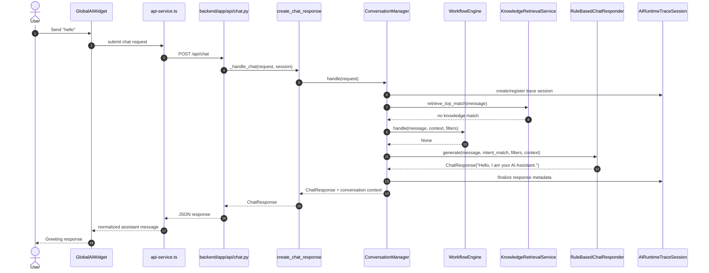

Step-by-step explanation:
1. `GlobalAiWidget` sends the message through `frontend/lib/ai-widget/services/api-service.ts`.
2. `backend/app/api/chat.py` delegates to `create_chat_response(...)`.
3. `create_chat_response(...)` constructs `ConversationManager` with `RuleBasedChatResponder`, `KnowledgeRetrievalService`, and `LLMRuntimeFacade`.
4. `ConversationManager.handle(...)` builds request-scoped conversation context and initializes `AIRuntimeTraceSession`.
5. `WorkflowEngine.handle(...)` returns `None` because greeting text does not resolve to a workflow.
6. `RuleBasedChatResponder.generate(...)` detects the greeting and returns the deterministic greeting response.
7. `ConversationManager` attaches updated conversation metadata and returns the final response.

Important production considerations:
- Greeting responses still traverse the full backend orchestration boundary; they are not frontend-only.
- Knowledge retrieval is attempted before deterministic fallback when no workflow is active, even when it returns no match.
- Controlled generation does not activate for greeting turns unless the later deterministic response is eligible and runtime policy allows it.

## 2. Normal User Conversation

Description: Non-workflow, non-knowledge conversation that resolves on the deterministic path after `ConversationManager` completes baseline routing and controlled-generation eligibility checks.

Trigger: The user asks a general question that does not become a workflow and does not retrieve a knowledge document.

Preconditions:
- No active workflow exists in conversation context.
- `KnowledgeRetrievalService` returns no usable match.
- `RuleBasedChatResponder` can answer or fall back with a generic deterministic reply.

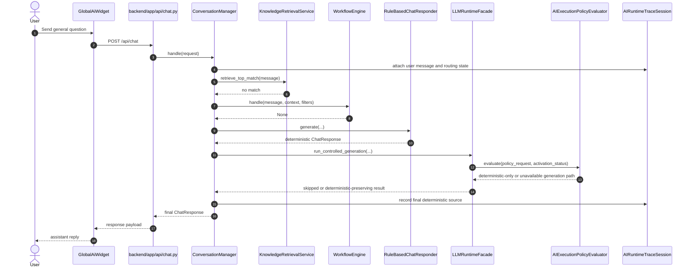

Step-by-step explanation:
1. `ConversationManager` extracts entities, merges filters, and detects intent.
2. Knowledge lookup runs first, but no document is selected.
3. `WorkflowEngine` declines ownership, so deterministic chat becomes the baseline path.
4. `RuleBasedChatResponder` produces the official response.
5. `ConversationManager` may still call `LLMRuntimeFacade.run_controlled_generation(...)`, but only after the official deterministic response already exists.
6. If runtime policy does not allow LLM execution, the facade returns a skipped or deterministic-preserving result and the visible reply remains deterministic.

Important production considerations:
- The actual decision point for visible AI augmentation happens after the baseline response is known.
- The execution-policy seam is reached through `LLMRuntimeFacade`, not directly by the API route.
- Deterministic routing remains authoritative even when the LLM runtime is composed and healthy.

## 3. Workflow Detection

Description: Workflow-owned turn where `WorkflowEngine` takes control and calls business services before any visible LLM output is considered.

Trigger: The user asks to book, cancel, or confirm an appointment.

Preconditions:
- Message content resolves to a workflow type or continues an active workflow.
- Required business services and database session are available.

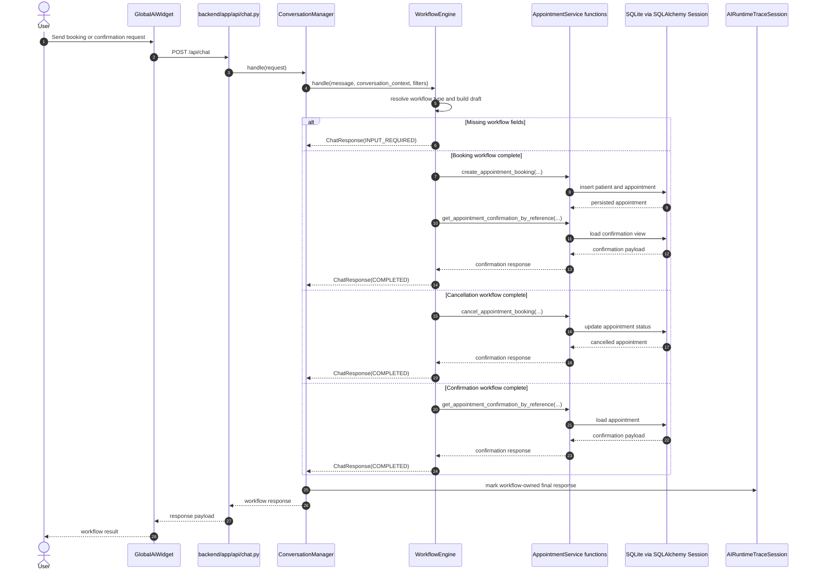

Step-by-step explanation:
1. `WorkflowEngine` resolves workflow ownership from message text, active workflow state, and extracted follow-up fields.
2. It builds a `ChatWorkflowDraft` and determines missing required fields.
3. For incomplete workflows, it returns an `INPUT_REQUIRED` response without any business write.
4. For complete workflows, it calls `create_appointment_booking(...)`, `cancel_appointment_booking(...)`, or `get_appointment_confirmation_by_reference(...)`.
5. `ConversationManager` receives the workflow response and preserves workflow ownership in the final route metadata.
6. `ConversationManager` short-circuits visible controlled generation for workflow-owned turns and returns the workflow result directly.

Important production considerations:
- Workflow detection happens before deterministic chat fallback.
- Business APIs are invoked from `WorkflowEngine`, not from the rule-based responder.
- Workflow-owned turns remain deterministic even when the LLM runtime is available.

## 4. Knowledge Retrieval (Vector-less RAG)

Description: FAQ-style request answered from the local knowledge repository through deterministic retrieval. Prompt building is not invoked on this visible path in the current implementation.

Trigger: The user asks an informational question such as payment methods or parking.

Preconditions:
- No active workflow exists.
- `KnowledgeRetrievalService` finds a matching repository document.
- Intent remains knowledge-eligible, such as `UNKNOWN` or `APPOINTMENT_HELP`.

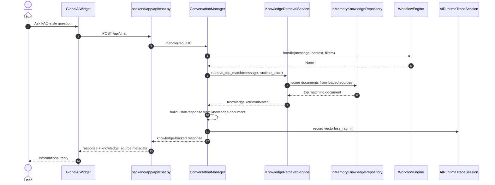

Step-by-step explanation:
1. `ConversationManager` keeps workflow detection first; only non-workflow turns can use knowledge retrieval.
2. `KnowledgeRetrievalService.retrieve_top_match(...)` scores already-loaded Markdown/JSON repository documents.
3. `ConversationManager` converts the selected document into a visible `ChatResponse` and attaches `knowledge_source` metadata.
4. The Prompt Builder is not called in this visible deterministic knowledge path.

Important production considerations:
- The prompt file asked for Prompt Builder here, but current code does not invoke it; the repository implementation is the source of truth.
- Knowledge retrieval is deterministic, local, and read-only.
- Knowledge answers can still become the deterministic baseline for later hybrid controlled generation.

## 5. Controlled Generation

Description: Low-risk visible augmentation path where the deterministic baseline response is already known and the facade runs policy, orchestration, validation, eligibility, composition, and post-processing.

Trigger: The user asks an eligible low-risk conversational question and runtime activation allows generation.

Preconditions:
- No workflow owns the request.
- `ConversationManager` has already produced a deterministic or knowledge baseline response.
- `LLMRuntimeFacade` resolves a generation-capable execution mode such as `LLM_ONLY` or `HYBRID`.

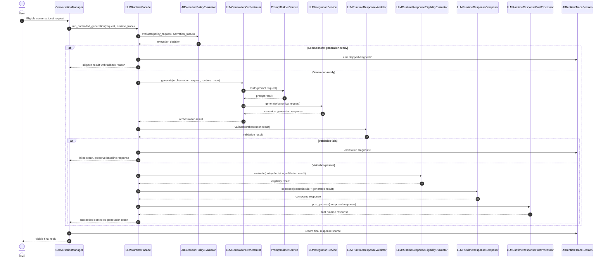

Step-by-step explanation:
1. `ConversationManager` constructs `LLMControlledGenerationRequest` only after the baseline response exists.
2. `LLMRuntimeFacade` evaluates execution policy against composed runtime activation state.
3. If generation is allowed, `LLMGenerationOrchestrator` runs prompt building and provider-neutral generation.
4. The facade validates the returned canonical response, then runs visibility eligibility.
5. `LLMRuntimeResponseComposer` preserves business truth while adding allowed generated text.
6. `LLMRuntimeResponsePostProcessor` normalizes presentation before the final response is returned.

Important production considerations:
- Validation and eligibility are separate gates with separate fallback behavior.
- `HYBRID` mode preserves deterministic or knowledge truth while adding approved guidance.
- Controlled-generation `SKIPPED` and `FAILED` outcomes still produce structured runtime-trace diagnostics.

## 6. Prompt Builder Flow

Description: Deterministic prompt construction pipeline used by orchestration and shadow/controlled generation.

Trigger: `LLMGenerationOrchestrator.generate(...)` needs a prompt for provider-neutral generation.

Preconditions:
- `PromptBuilderService` is attached through `LLMRuntimeCompositionRoot`.
- Caller supplies conversation state and any already-selected knowledge documents.

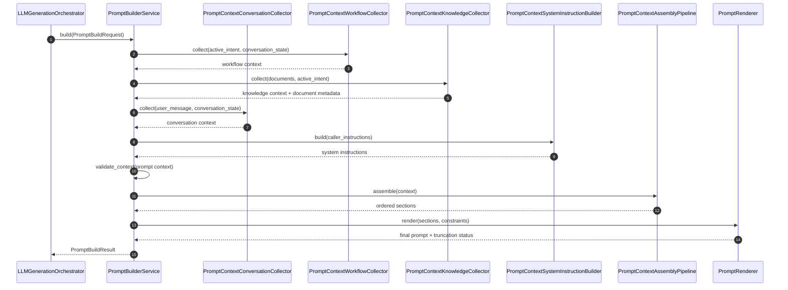

Step-by-step explanation:
1. `PromptBuilderService.build(...)` normalizes workflow, knowledge, conversation, and system-instruction inputs.
2. `validate_context(...)` enforces prompt-context consistency before rendering.
3. `PromptContextAssemblyPipeline` creates ordered prompt sections from the validated context.
4. `PromptRenderer` produces the final bounded prompt string and truncation flag.

Important production considerations:
- The builder never selects knowledge documents itself; it only formats caller-supplied documents.
- Prompt validation failures stop orchestration before any provider call.
- This layer remains deterministic and provider-neutral.

## 7. LLM Runtime

Description: Provider-neutral orchestration, registry lookup, adapter translation, transport invocation, and canonical response normalization.

Trigger: The facade reaches orchestration and the runtime is generation-ready.

Preconditions:
- `LLMRuntimeCompositionRoot` has composed configuration, transports, adapters, and registry.
- A provider name is resolved explicitly or through the default provider.

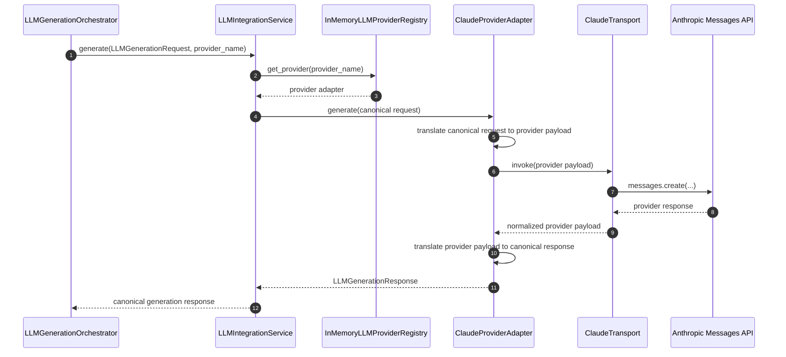

Step-by-step explanation:
1. `LLMIntegrationService` resolves the provider through `InMemoryLLMProviderRegistry`.
2. The selected adapter translates canonical request fields into provider-native payload shape.
3. `ClaudeTransport` performs the live Anthropic SDK call.
4. Transport and adapter normalize the provider response back into the canonical response contract.

Important production considerations:
- The current production transport path is concrete only for Claude.
- Provider-specific outbound serialization strips unsupported internal metadata before the Anthropic call.
- Registry lookup failure or missing transport raises provider-boundary errors before validation is reached.

## 8. Runtime Validation

Description: Canonical validation gate that checks orchestrated generation output before eligibility or visible composition.

Trigger: `LLMRuntimeFacade` receives an orchestration result from `LLMGenerationOrchestrator`.

Preconditions:
- Orchestration completed without raising an exception.
- The request is in a generation-capable mode.

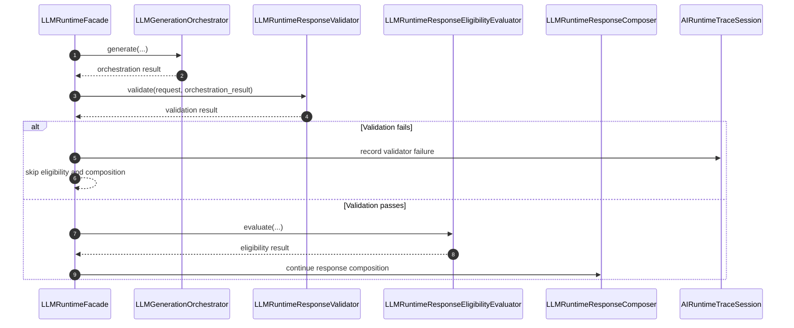

Step-by-step explanation:
1. Validation runs inside the facade after orchestration and before any eligibility check.
2. The validator inspects the canonical response shape, not provider-native payloads.
3. Failed validation terminates the LLM-visible path and preserves the baseline response.

Important production considerations:
- Validation failure is treated as a controlled failure, not as a business-logic exception.
- Eligibility and composition do not run on invalid canonical output.
- Validator diagnostics are written into the runtime trace.

## 9. Post Processing

Description: Final visible-response normalization after composition has already preserved deterministic truth and optional augmentation.

Trigger: `LLMRuntimeFacade` receives a composed response from `LLMRuntimeResponseComposer`.

Preconditions:
- Composition has already succeeded.
- The request has not already fallen back to deterministic-only before composition.

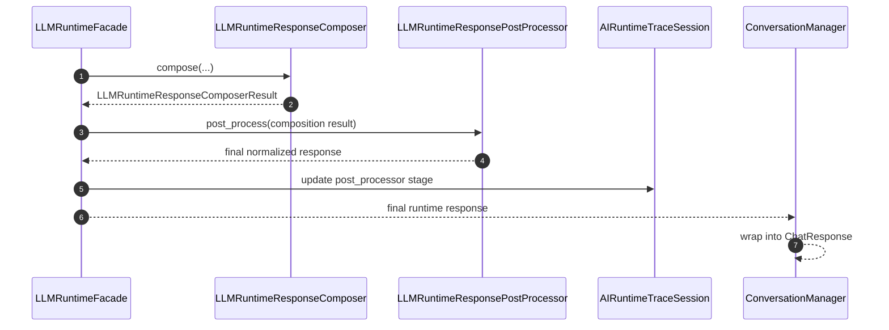

Step-by-step explanation:
1. The composer creates the canonical final response for deterministic-only, hybrid, or LLM-only modes.
2. `LLMRuntimeResponsePostProcessor` then normalizes whitespace, markdown, and presentation metadata.
3. `ConversationManager` converts the final runtime response into the visible chat response contract.

Important production considerations:
- Post-processing happens after composition, not before.
- Business fields are preserved upstream by the composer; post-processing is presentation-oriented.
- Post-processing can still fall back safely if it cannot complete.

## 10. Runtime Trace Logging

Description: Request-scoped trace capture that persists one raw JSON trace per request from the conversation-manager boundary.

Trigger: A chat request starts with `AI_RUNTIME_TRACE=true`.

Preconditions:
- Runtime tracing is enabled in settings.
- `AIRuntimeTraceSession` is registered for the request.

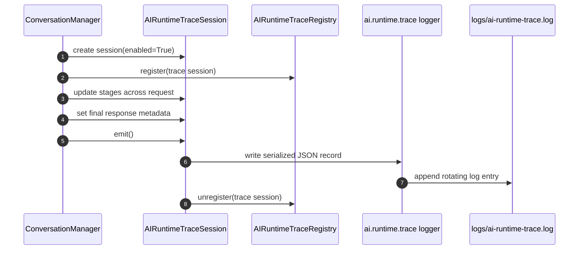

Step-by-step explanation:
1. `ConversationManager` creates and registers the request trace session at the start of `handle(...)`.
2. Runtime participants update stage payloads through the same trace object or trace id.
3. The final emit happens once from the `ConversationManager` `finally` path.
4. Output is written through the dedicated `ai.runtime.trace` rotating file logger.

Important production considerations:
- Trace emission is exact-once per request.
- Trace payloads redact common PII patterns before persistence.
- The trace logger auto-creates `logs/ai-runtime-trace.log` when needed.

## 11. Business Workflow Example

Description: Concrete example of a booking workflow turn completing through business services and then surfacing the deterministic booking result to the user.

Trigger: The user provides all required booking fields in chat.

Preconditions:
- Doctor, date, time, patient name, and email are present in the accumulated workflow draft.

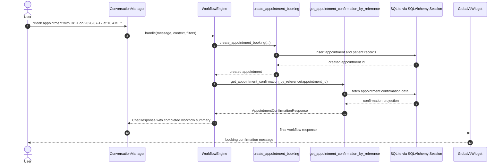

Step-by-step explanation:
1. `WorkflowEngine` constructs a complete booking request from the draft.
2. `create_appointment_booking(...)` performs the business write through the shared session.
3. `WorkflowEngine` immediately resolves confirmation data through `get_appointment_confirmation_by_reference(...)`.
4. The returned workflow summary becomes the visible chat result.

Important production considerations:
- The visible booking result is always grounded in persisted backend state.
- Booking validation failures are converted back into workflow retry responses when possible.
- No provider-generated text is required to complete the transaction.

## 12. Fallback Flow

Description: Full fallback ladder when a turn does not resolve to workflow ownership and either knowledge or LLM execution cannot produce a visible augmented response.

Trigger: The user sends an unknown or unsupported request.

Preconditions:
- Workflow detection returns `None`.
- Knowledge may miss, and controlled generation may be skipped, fail validation, or fail eligibility.

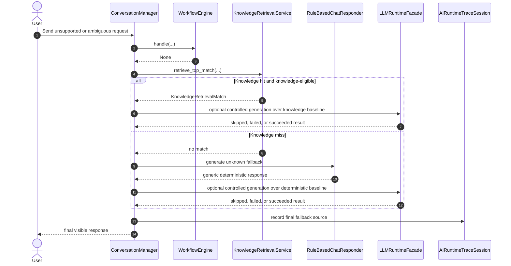

Step-by-step explanation:
1. The fallback ladder is workflow first, then knowledge, then deterministic responder, then optional controlled generation over the official baseline.
2. Knowledge can directly provide the visible baseline when a match exists and the intent is knowledge-eligible.
3. Controlled generation never replaces the need for a baseline deterministic owner.

Important production considerations:
- The runtime does not jump directly from unknown intent to LLM execution.
- Fallback reasons are retained in trace diagnostics for skipped and failed LLM paths.
- This ordering is the core safety behavior of the current assistant.

## 13. Provider Failure

Description: Provider-boundary failure where adapter or transport invocation fails and the runtime falls back without exposing provider errors to the user.

Trigger: `ClaudeTransport` or provider invocation raises an exception during controlled generation.

Preconditions:
- Execution policy allowed generation.
- Provider registry resolved a provider adapter.

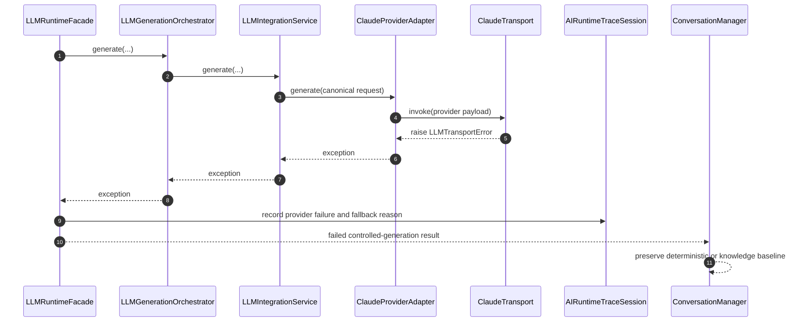

Step-by-step explanation:
1. Transport failure is normalized into `LLMTransportError`.
2. The exception propagates back through adapter, integration service, and orchestrator.
3. The facade converts the failure into a controlled fallback outcome.
4. `ConversationManager` keeps the preexisting official response instead of surfacing the provider error.

Important production considerations:
- Provider exceptions are observable in runtime trace logs but not exposed to end users.
- Retry behavior is modeled in operational readiness, but the visible chat path still degrades safely without retry guarantees.
- Failure at the provider boundary means validation, eligibility, composition, and post-processing may never execute.

## 14. Complete End-to-End Runtime

Description: Consolidated end-to-end runtime for an eligible conversational request that reaches controlled generation and returns a visible final response.

Trigger: A low-risk user message enters chat while runtime activation is healthy and generation is allowed.

Preconditions:
- Frontend widget and backend chat route are available.
- No workflow owns the request.
- Execution policy resolves a generation-capable mode.

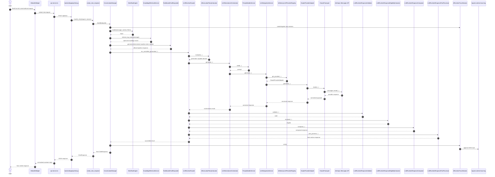

Step-by-step explanation:
1. The browser request enters the shared chat backend route and is routed into `ConversationManager`.
2. `ConversationManager` establishes workflow-first and knowledge-first baseline routing.
3. `LLMRuntimeFacade` only runs after an official response owner already exists.
4. Orchestration builds the prompt and executes provider-neutral generation through registry, adapter, and transport boundaries.
5. Validation, eligibility, composition, and post-processing convert raw generation into a governed visible response.
6. The trace is emitted once at the end of the request lifecycle.

Important production considerations:
- This full path exists only for eligible low-risk conversational requests.
- The visible runtime remains deterministic-first even on the most LLM-rich path.
- Every participant shown above maps to a concrete implementation component in the current repository.
