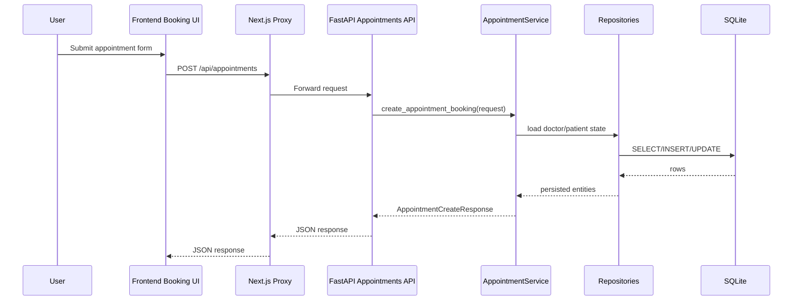
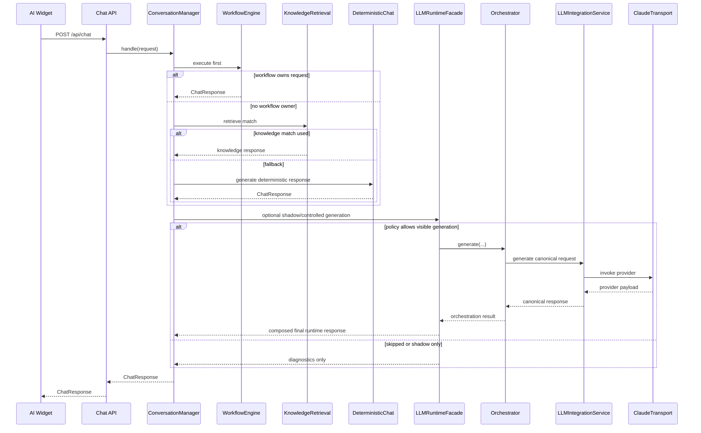
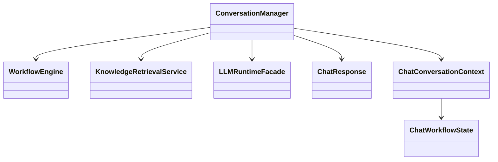
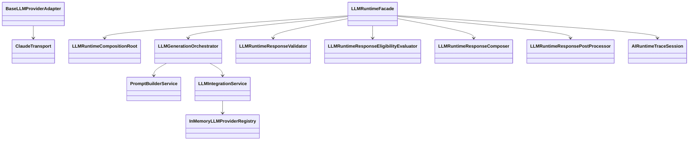

# Low Level Design

Date: 2026-07-09

## Scope

This document describes the current low-level design of the repository as implemented. It reflects the live codebase exactly and does not propose a target redesign.

## Folder Structure

```txt
frontend/
  app/
    api/[...path]/route.ts
    appointments/
    doctors/
  components/
  features/
    appointments/
    doctors/
  lib/
    ai-widget/
    api-client.ts
  stores/

backend/
  app/
    api/
    core/
    db/
    knowledge/
      sources/
    llm/
    models/
    repositories/
    schemas/
    services/
  scripts/

docs/
  prompts/9-documentation-pipeline/
  reports/architecture/
  ai-content/
```

## Package Structure

### Frontend packages

- `frontend/app/`
  - App Router pages and the catch-all backend proxy.
- `frontend/components/`
  - Route-facing shared UI such as doctor listing and layout shell.
- `frontend/features/appointments/`
  - Appointment-domain API calls, validation schema, hooks, types, and components.
- `frontend/features/doctors/`
  - Doctor-domain API mapping and frontend-facing doctor models.
- `frontend/lib/ai-widget/`
  - Self-contained AI widget library with components, state, service adapters, mappers, and types.
- `frontend/stores/`
  - Zustand cross-route booking state.

### Backend packages

- `backend/app/api/`
  - Thin FastAPI route handlers.
- `backend/app/core/`
  - Core settings and shared backend errors.
- `backend/app/db/`
  - SQLAlchemy engine/session bootstrapping, schema init, and doctor seeding.
- `backend/app/knowledge/`
  - Deterministic knowledge document definitions, loading, repository caching, and retrieval.
- `backend/app/llm/`
  - Provider-neutral runtime models, orchestration, policy, activation, composition, adapters, transport, and tracing.
- `backend/app/models/`
  - SQLAlchemy ORM entities.
- `backend/app/repositories/`
  - Data-access helpers over ORM models.
- `backend/app/schemas/`
  - Pydantic request and response contracts.
- `backend/app/services/`
  - Business logic, deterministic chat routing, workflows, schedule generation, and prompt building.

## Module Responsibilities

### Frontend runtime

- `frontend/app/layout.tsx`
  - Mounts the global shell and `GlobalAiWidget`.
- `frontend/app/api/[...path]/route.ts`
  - Proxies all frontend API traffic to `BACKEND_API_BASE_URL` or `http://localhost:4001`.
- `frontend/lib/api-client.ts`
  - Central fetch wrapper; sets JSON headers, disables caching, and normalizes API errors.
- `frontend/app/appointments/page.tsx`
  - Main booking-flow container.
- `frontend/stores/booking-store.ts`
  - Persists selected doctor, slot, patient details, and confirmation data across routes.
- `frontend/lib/ai-widget/services/chat-response-mapper.ts`
  - Maps backend chat payloads into widget messages and preserves workflow and `knowledge_source` metadata.

### Backend business runtime

- `backend/app/main.py`
  - Creates the FastAPI app, applies CORS, runs `init_db()`, and mounts `/api`.
- `backend/app/api/router.py`
  - Registers health, chat, doctors, availability, and appointments routes.
- `backend/app/services/doctor_service.py`
  - Doctor query orchestration.
- `backend/app/services/schedule_service.py`
  - Static daily slot definitions.
- `backend/app/services/availability_service.py`
  - Generated availability from schedule plus booked appointments.
- `backend/app/services/appointment_service.py`
  - Appointment validation, patient upsert-by-email, booking persistence, and confirmation lookup.
- `backend/app/services/appointment_search_service.py`
  - Joined appointment search by patient identity fields.
- `backend/app/services/chat_service.py`
  - Deterministic fallback chat generator and structured doctor/availability responses.
- `backend/app/services/chat_intent_detector.py`
  - Intent classification for doctor search, availability, booking help, booking, cancellation help, cancellation, confirmation, and unknown.
- `backend/app/services/chat_entity_extractor.py`
  - Search-filter, date, time, and doctor-reference extraction.

### Backend AI runtime

- `backend/app/services/conversation_manager.py`
  - Primary chat orchestration entry point.
- `backend/app/services/workflow_engine.py`
  - Request-scoped workflow executor for booking, cancellation, and confirmation lookup.
- `backend/app/knowledge/retrieval.py`
  - Deterministic Vector-less RAG scorer and selector.
- `backend/app/services/prompt_builder.py`
  - Deterministic prompt-construction pipeline.
- `backend/app/llm/facade.py`
  - Public runtime boundary for shadow mode and controlled generation.
- `backend/app/llm/validation.py`
  - Canonical runtime-response validation gate.
- `backend/app/llm/eligibility.py`
  - User-visibility gate for low-risk intents only.
- `backend/app/llm/composer.py`
  - Deterministic-only, LLM-only, and hybrid final-response composition.
- `backend/app/llm/post_processor.py`
  - Presentation normalization and presentation-metadata sanitization.
- `backend/app/llm/registry.py`
  - In-memory provider registry.
- `backend/app/llm/providers.py`
  - Configurable provider adapters and transport protocol.
- `backend/app/llm/transport.py`
  - Production Claude transport over the Anthropic SDK.
- `backend/app/llm/runtime_trace.py`
  - Request-scoped runtime trace aggregation and rotating-file emission.

## Class Responsibilities

### Core chat orchestration classes

- `ConversationManager`
  - Builds conversation context from request metadata and history.
  - Runs workflow-first routing.
  - Invokes knowledge retrieval only when no workflow is active.
  - Falls back to the deterministic chat engine.
  - Invokes shadow mode or controlled generation through `LLMRuntimeFacade`.
  - Emits the final runtime trace once in the `finally` path.

- `WorkflowEngine`
  - Detects workflow ownership.
  - Builds and merges workflow draft state.
  - Collects booking fields from free text.
  - Calls booking, cancellation, and confirmation services.
  - Returns `ChatWorkflowResult` for the chat contract.

### Prompt builder classes

- `PromptBuilderService`
  - Main deterministic prompt-build service.
- `PromptContextConversationCollector`
  - Normalizes caller-supplied conversation state into canonical conversation context.
- `PromptContextWorkflowCollector`
  - Normalizes caller-supplied workflow state into canonical workflow context.
- `PromptContextKnowledgeCollector`
  - Converts selected knowledge documents into prompt-safe context blocks.
- `PromptSystemInstructionBuilder`
  - Builds ordered system instructions from rules and caller context.
- `PromptContextValidator`
  - Validates prompt context before rendering.
- `PromptAssemblyPipeline`
  - Converts prompt context into ordered prompt sections.
- `PromptRenderer`
  - Renders final bounded prompt text and truncates if needed.

### LLM runtime classes

- `LLMRuntimeCompositionRoot`
  - Caches and assembles the runtime graph.
- `LLMIntegrationService`
  - Canonical provider-neutral entry point for generation against a provider registry.
- `LLMGenerationOrchestrator`
  - Builds prompts, constructs canonical generation requests, calls integration, and normalizes responses.
- `LLMRuntimeFacade`
  - Coordinates execution policy, orchestration, validation, eligibility, composition, and post-processing.
- `LLMRuntimeResponseValidator`
  - Enforces canonical response completeness and shape.
- `LLMRuntimeResponseEligibilityEvaluator`
  - Restricts visibility to approved low-risk conversational paths.
- `LLMRuntimeResponseComposer`
  - Preserves deterministic business truth while optionally appending LLM guidance.
- `LLMRuntimeResponsePostProcessor`
  - Normalizes markdown/whitespace and strips presentation-only metadata.
- `InMemoryLLMProviderRegistry`
  - Registers adapters and resolves providers by name.
- `BaseLLMProviderAdapter`
  - Shared translation pipeline around request translation, transport invocation, and response translation.
- `ConfigurableLLMProviderAdapter`
  - Adapter base that combines provider config, capability description, and optional transport.
- `ClaudeTransport`
  - Anthropic transport that serializes outbound requests, invokes `messages.create(...)`, normalizes responses, and maps errors.
- `AIRuntimeTraceSession`
  - Mutable per-request trace object with stage snapshots, stop reasons, exception capture, redaction, and emission.

## Interfaces

### Backend provider-neutral interfaces

- `LLMRequestTranslator[ProviderRequestT]`
  - `translate_request(request: LLMGenerationRequest) -> ProviderRequestT`
- `LLMResponseTranslator[ProviderResponseT]`
  - `translate_response(response, request) -> LLMGenerationResponse`
- `LLMProvider`
  - `describe() -> LLMProviderDescriptor`
  - `generate(request) -> LLMGenerationResponse`
- `LLMProviderRegistry`
  - `list_providers()`
  - `get_provider(provider_name)`
  - `get_default_provider_name()`
- `LLMProviderTransport`
  - `invoke(request: ProviderPayload) -> ProviderPayload`
- `DeterministicChatEngine`
  - `generate(...) -> ChatResponse`
- `LLMShadowExecutionRunner`
  - `submit(task)`

## Data Models

### Persistence models

- `Doctor`
  - Doctor profile, specialties, fee range, clinic metadata, JSON-string fields for appointment types and languages.
- `Patient`
  - Patient identity and contact details; unique email.
- `Appointment`
  - Doctor/patient linkage, date/time, type, health description, confirmation code, and status.
- `DoctorAvailability`
  - Legacy availability table retained in schema but not used as the active slot source.

### Business/API models

- `AppointmentCreateRequest`
  - `doctor_id`, `appointment_date`, `start_time`, `appointment_type`, `patient`, `health_description`
- `AppointmentCreateResponse`
  - `id`, `confirmation_code`, `status`, `doctor_id`, `patient_id`, `appointment_date`, `start_time`, `end_time`
- `AppointmentConfirmationResponse`
  - Full appointment plus doctor and patient summaries.
- `ChatRequest`
  - `message` plus optional `conversation`.
- `ChatResponse`
  - `intent`, `message`, `data`, `search_filters`, `help_steps`, `knowledge_source`, `conversation`, `workflow`
- `ChatConversationContext`
  - Conversation id, turn count, selected doctor, active filters, routing target, and current workflow state.
- `ChatWorkflowDraft`
  - Partial booking/cancellation/confirmation fields collected across turns.
- `ChatWorkflowResult`
  - Workflow type, status, missing fields, draft, and optional appointment summary.
- `ChatKnowledgeSource`
  - Source metadata for knowledge-backed replies.

### LLM canonical models

- `LLMGenerationOrchestrationRequest`
  - User message, conversation state, documents, active intent, system instructions, prompt limit, provider/model selection, constraints, structured-output, tools, reasoning, streaming, metadata.
- `LLMGenerationOrchestrationResult`
  - Rendered prompt, prompt blocks, included/excluded docs, normalized response message, finish reason, provider/model metadata, usage, citations, tool calls, and diagnostics metadata.
- `LLMRuntimeResponse`
  - Final provider-neutral runtime envelope: `message`, `data`, `metadata`.
- `LLMControlledGenerationRequest`
  - Policy request plus deterministic response and orchestration request.
- `LLMControlledGenerationResult`
  - Policy decision, execution status, validator result, eligibility result, composition result, post-processing result, and final response.

## Runtime Pipeline

### Standard API path

1. Browser page or widget calls `apiClient`.
2. `frontend/app/api/[...path]/route.ts` forwards the request to FastAPI.
3. FastAPI route validates input and delegates to a service.
4. Service reads/writes through repositories and ORM models.
5. Pydantic response model is returned through the proxy to the frontend.

### Chat pipeline

1. Widget posts `ChatRequest`.
2. `backend/app/api/chat.py` forwards to `ConversationManager`.
3. `ConversationManager` reconstructs `ChatConversationContext`.
4. `WorkflowEngine` gets first ownership check and execution opportunity.
5. If no active workflow owns the turn, deterministic knowledge retrieval may answer FAQ-style prompts.
6. If retrieval does not finalize the turn, `chat_service.py` produces the deterministic response.
7. `LLMRuntimeFacade` may run hidden shadow mode or policy-gated controlled generation.
8. Controlled generation, if allowed, passes validator -> eligibility -> composer -> post processor.
9. Final response and updated conversation metadata return to the widget.
10. `AIRuntimeTraceSession.emit()` writes a single JSON trace if enabled.

## Conversation Manager

`ConversationManager` owns request-scoped chat state assembly and final response selection.

- Inputs
  - `ChatRequest.message`
  - optional `ChatConversationRequest`
  - SQLAlchemy session
- Internal state construction
  - merges prior history filters
  - carries selected doctor and prior intent
  - reconstructs active workflow state from metadata
- Decision order
  - active workflow continuation or new workflow execution
  - deterministic knowledge retrieval for `UNKNOWN` and `APPOINTMENT_HELP`
  - deterministic fallback chat engine
  - optional facade shadow/controlled generation
- Outputs
  - `ChatResponse`
  - updated `conversation`
  - optional `knowledge_source`
  - optional `workflow`

## Workflow Engine

`WorkflowEngine` is a request-scoped deterministic state machine driven by free-text extraction and service calls.

- Supported workflow types
  - `BOOK_APPOINTMENT`
  - `CANCEL_APPOINTMENT`
  - `APPOINTMENT_CONFIRMATION`
- Booking behavior
  - detects doctor reference
  - extracts date, time, appointment type, patient details, and health description
  - merges with existing draft
  - returns `INPUT_REQUIRED`, `READY`, or `COMPLETED`
  - calls `create_appointment_booking(...)` when mandatory fields are complete
- Cancellation behavior
  - looks for confirmation code or appointment id
  - delegates to cancellation service
- Confirmation behavior
  - resolves confirmation code or appointment id
  - delegates to confirmation lookup service

## Vector-less RAG

The knowledge path is deterministic and repository-local.

- Source files
  - `backend/app/knowledge/sources/faq/*.md`
  - `backend/app/knowledge/sources/structured/*.json`
- Main modules
  - `documents.py`
  - `loader.py`
  - `repository.py`
  - `retrieval.py`
- Runtime behavior
  - loads Markdown and JSON knowledge documents into an in-memory repository
  - uses weighted title, alias, keyword, synonym, category, and body matching
  - filters broad tokens to avoid stealing doctor search, fee, and availability intents
  - returns the top deterministic document match only
  - is bypassed whenever a workflow is active

## Prompt Builder

The prompt builder is implemented but only used through the LLM runtime path.

- Canonical input
  - `PromptBuildRequest`
- Main phases
  - collect conversation context
  - collect workflow context
  - collect knowledge context
  - build system instructions
  - validate prompt context
  - assemble ordered sections
  - render final bounded prompt
- Core renderable units
  - `PromptContextBlock`
  - `PromptAssemblySection`
  - `PromptRenderResult`

## Runtime Facade

`LLMRuntimeFacade` is the public runtime boundary.

- Snapshot responsibilities
  - exposes integration boundary state through `LLMRuntimeFacadeSnapshot`
- Shadow mode responsibilities
  - schedules or runs hidden LLM execution
  - records `LLMShadowModeDiagnostic`
  - never changes the visible response
- Controlled generation responsibilities
  - evaluates execution policy
  - invokes `LLMGenerationOrchestrator`
  - validates canonical result
  - checks user-visibility eligibility
  - composes deterministic and LLM outputs
  - post-processes the final envelope
  - returns `LLMControlledGenerationResult`

## Runtime Validator

`LLMRuntimeResponseValidator` checks canonical runtime generation results.

- Validates
  - non-empty prompt
  - presence of response message
  - assistant role only
  - non-empty non-whitespace content
  - canonical finish reason
  - structured output when requested
  - mapping shape for provider/model metadata
- Emits
  - `LLMRuntimeResponseValidationResult`
  - issue list and diagnostics

## Eligibility

`LLMRuntimeResponseEligibilityEvaluator` is the user-visibility gate.

- Requires
  - valid validator result
  - execution mode in `LLM_ONLY` or `HYBRID`
  - policy approval for visible LLM execution
  - active intent in the low-risk set: `UNKNOWN`, `APPOINTMENT_HELP`, `CANCEL_APPOINTMENT_HELP`
- Rejects
  - workflow-owned or business-owned requests
  - non-approved intents
  - invalid canonical results

## Composer

`LLMRuntimeResponseComposer` supports three modes.

- `DETERMINISTIC_ONLY`
  - preserves business response only
- `LLM_ONLY`
  - uses validated and eligible LLM output, or falls back
- `HYBRID`
  - preserves deterministic business fields and appends LLM guidance when available

The final envelope is always `LLMRuntimeResponse`.

## Post Processor

`LLMRuntimeResponsePostProcessor` performs final presentation normalization.

- Normalizes
  - line endings
  - trailing spaces
  - markdown heading spacing
  - bullet and ordered-list formatting
  - duplicate blank lines
- Sanitizes
  - `display_metadata`
  - `presentation`
  - `presentation_metadata`
  - `rendering_metadata`
  - `ui_metadata`

## Provider Registry

`InMemoryLLMProviderRegistry` is the live registry implementation.

- Register
  - `register(provider)`
- Resolve
  - `get_provider(provider_name)`
- Inspect
  - `list_providers()`
  - `get_default_provider_name()`

## Provider Adapter

Adapter layering is split between protocols and shared base classes.

- `LLMProvider`
  - external provider-neutral contract
- `BaseLLMProviderAdapter`
  - common generate pipeline
  - runtime trace updates around translation and transport
- `ConfigurableLLMProviderAdapter`
  - validates provider/config match
  - exposes capabilities
  - translates common request pieces
  - requires an explicit transport
- Concrete adapters
  - live in `backend/app/llm/providers.py`
  - cover OpenAI, Claude, Gemini, OpenRouter, and Ollama configuration paths
  - only Claude has a production transport path today

## Provider Transport

`ClaudeTransport` is the current production transport.

- Inputs
  - provider-native payload from the Claude adapter
- Responsibilities
  - create Anthropic SDK client
  - build supported `messages.create(...)` payload
  - strip unsupported internal metadata
  - invoke request
  - normalize request id, response id, status, latency, and usage
  - map provider errors into `LLMTransportError`
  - publish transport-stage runtime trace diagnostics

## Runtime Trace

`AIRuntimeTraceSession` records one trace per chat request when `AI_RUNTIME_TRACE=true`.

- Fixed stages
  - `conversation_manager`
  - `workflow_engine`
  - `vectorless_rag`
  - `execution_policy`
  - `runtime_facade`
  - `prompt_builder`
  - `llm_integration`
  - `provider_adapter`
  - `provider_transport`
  - `runtime_validator`
  - `eligibility`
  - `composer`
  - `post_processor`
  - `final_response`
- Features
  - PII redaction for common name/email/phone patterns
  - stop-component and stop-reason capture
  - exception stack traces
  - final-response preview
  - rotating JSON file output to `logs/ai-runtime-trace.log`

## Configuration Files

- `backend/app/core/config.py`
  - app name, API prefix, database URL, CORS origins, AI runtime trace flag
- `backend/app/llm/config.py`
  - provider-neutral runtime flags, selected provider, provider-specific credentials, transport settings, and generation-budget defaults
- `frontend/app/api/[...path]/route.ts`
  - backend base URL selection for the frontend proxy
- `frontend/lib/api-client.ts`
  - frontend API base URL selection
- `.env`
  - runtime source for backend and LLM settings
- `.env.example`
  - documented LLM config surface

## Environment Variables

### Frontend

- `NEXT_PUBLIC_API_BASE_URL`
  - defaults to `/api`
- `BACKEND_API_BASE_URL`
  - defaults to `http://localhost:4001`

### Backend core

- `APP_NAME`
- `API_PREFIX`
- `DATABASE_URL`
- `CORS_ORIGINS`
- `AI_RUNTIME_TRACE`

### LLM runtime

- `LLM_PROVIDER`
- `LLM_ENABLED`
- `LLM_SHADOW_MODE`
- `LLM_ALLOW_GENERATION`
- `LLM_ALLOW_STREAMING`
- `LLM_ALLOW_TOOL_CALLING`
- `LLM_ALLOW_REASONING`
- `LLM_TIMEOUT_SECONDS`
- `LLM_MAX_RETRIES`
- `LLM_RETRY_BACKOFF_SECONDS`
- `LLM_GENERATION_BUDGET__DEFAULT_PROFILE`
- `LLM_OPENAI__*`
- `LLM_CLAUDE__*`
- `LLM_GEMINI__*`
- `LLM_OPENROUTER__*`
- `LLM_OLLAMA__*`

## API Contracts

### Doctors

- `GET /api/doctors`
- `GET /api/doctors/{doctor_id}`

### Availability

- `GET /api/doctors/{doctor_id}/availability?date=YYYY-MM-DD`

### Appointments

- `POST /api/appointments`
  - request: `AppointmentCreateRequest`
  - response: `AppointmentCreateResponse`
- `GET /api/appointments/{appointment_id}`
  - response: `AppointmentConfirmationResponse` or `AppointmentDetailsResponse` depending on route usage
- `GET /api/appointments/search`
  - response: appointment search result collection

### Chat

- `POST /api/chat`
- `POST /api/v1/chat`
  - request: `ChatRequest`
  - response: `ChatResponse`

## Internal Request Flow

### Booking request

```txt
Appointment page
  -> apiClient.post("/appointments")
  -> Next.js proxy route
  -> FastAPI appointments route
  -> appointment_service.create_appointment_booking(...)
  -> patient_repository + appointment_repository
  -> SQLite commit
  -> AppointmentCreateResponse
```

### Chat request

```txt
GlobalAiWidget
  -> chat api service
  -> /api/chat
  -> chat route
  -> ConversationManager
  -> WorkflowEngine or KnowledgeRetrievalService or deterministic chat engine
  -> optional LLMRuntimeFacade
  -> ChatResponse
```

## Internal Response Flow

### Controlled-generation response flow

1. `LLMGenerationOrchestrator` returns canonical result.
2. `LLMRuntimeResponseValidator` validates it.
3. `LLMRuntimeResponseEligibilityEvaluator` checks visibility.
4. `LLMRuntimeResponseComposer` selects deterministic-only, LLM-only, or hybrid output.
5. `LLMRuntimeResponsePostProcessor` normalizes final text and sanitizes metadata.
6. `ConversationManager` maps the final runtime envelope back into the chat response path.

## Sequence Diagrams (Mermaid)

### Booking flow



### Chat flow with optional controlled generation



## Class Diagrams (Mermaid)

### Chat orchestration



### LLM runtime



## State Flow

### Conversation state

1. Frontend sends current conversation metadata and message history.
2. `ConversationManager` reconstructs `ChatConversationContext`.
3. Active filters, selected doctor, prior intent, and workflow draft are merged.
4. Response updates the context with the next selected doctor, filters, last messages, and workflow state.
5. Updated context returns to the widget and is resubmitted on the next turn.

### Workflow state

1. Workflow detected or resumed.
2. Draft fields extracted from the current message.
3. Missing fields recalculated.
4. Status becomes `INPUT_REQUIRED`, `READY`, or `COMPLETED`.
5. Completed booking returns appointment summary and clears workflow ownership.

### Controlled-generation state

1. Policy request built from deterministic response context.
2. Decision resolves mode and provider.
3. Orchestration result produced or skipped.
4. Validation and eligibility either approve or reject user-visible use.
5. Composition and post-processing produce the final runtime envelope or deterministic fallback.

## Extension Points

- Additional provider transports can implement `LLMProviderTransport`.
- Additional provider adapters can extend `ConfigurableLLMProviderAdapter`.
- `InMemoryLLMProviderRegistry` can be replaced by another `LLMProviderRegistry` implementation.
- `LLMShadowExecutionRunner` can swap threading for another async execution strategy.
- `PromptBuilderService` can accept richer caller-supplied workflow or knowledge context without changing the chat contract.
- New knowledge sources can be added under `backend/app/knowledge/sources/`.
- Runtime policy can broaden or narrow eligible intents without changing transport code.
- Conversation persistence can be added above `ChatConversationContext` without changing the current request contract.
