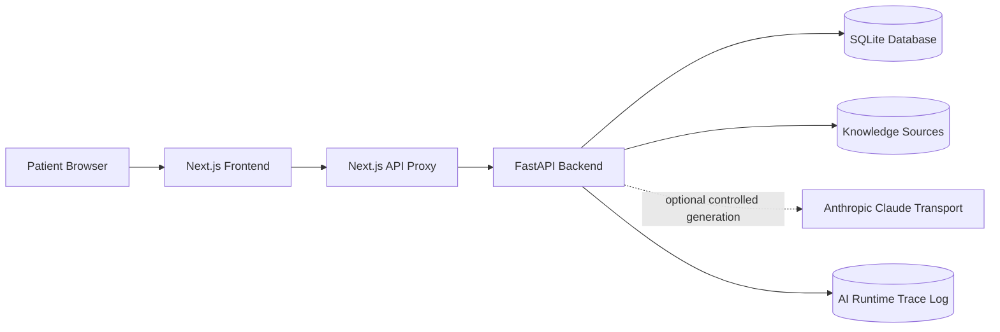
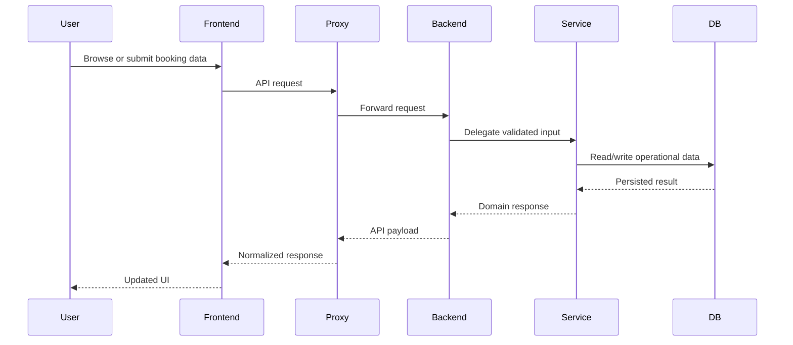
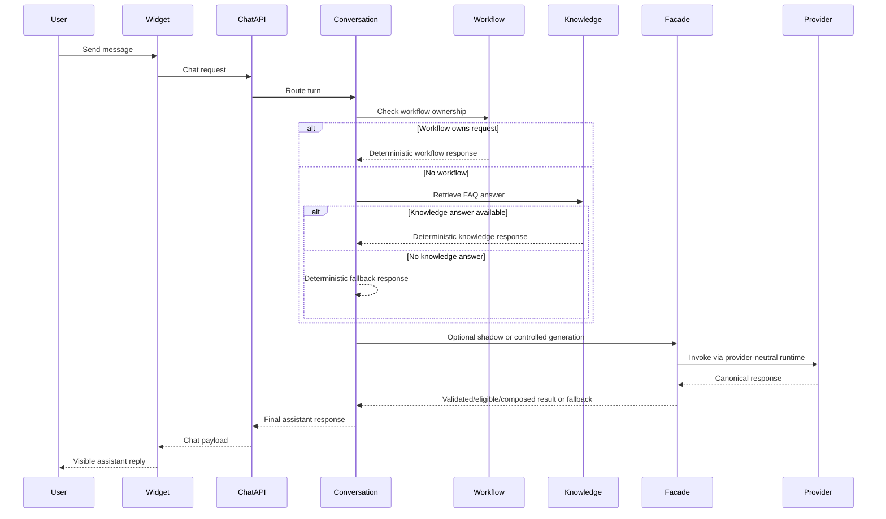
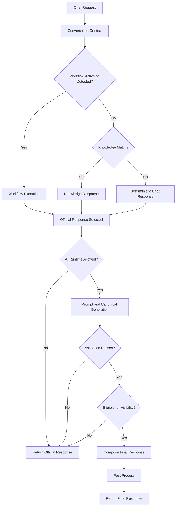
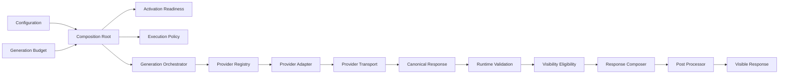

# Master Architecture

Date: 2026-07-09

## Purpose

This document explains the current AI-enabled appointment platform as a system architecture. It consolidates the implemented architecture into a single enterprise-facing view. It describes architectural structure, runtime boundaries, deployment shape, control points, and extension strategy without explaining code.

## Architectural Vision

The platform is designed as a business-rule-first healthcare scheduling system with an AI assistant layered around, not ahead of, operational truth. The architecture ensures that doctor discovery, availability, booking, confirmation, and appointment retrieval remain governed by deterministic services and validated persistence rules. AI capabilities are introduced as controlled orchestration layers that can assist, explain, and augment low-risk interactions without taking ownership of transactional correctness.

At a system level, the architecture aims to provide:

- a stable booking platform with clear frontend, backend, and persistence boundaries
- an assistant surface that improves user guidance without bypassing domain validations
- a provider-neutral AI runtime that can evolve independently of business services
- observability and control gates around any visible LLM behavior
- a deployment shape that is simple today and extensible toward a larger enterprise runtime later

## Design Philosophy

The current architecture follows a small set of strong design principles:

- Deterministic business ownership: booking, availability, confirmation, and operational workflows remain authoritative and non-probabilistic.
- Clear separation of concerns: presentation, API proxying, backend services, knowledge retrieval, AI runtime, and persistence remain isolated by responsibility.
- Provider neutrality: the LLM runtime is built around canonical contracts and adapters so provider choice does not reshape upstream business services.
- Safe augmentation: controlled generation is gated by activation, execution policy, validation, eligibility, response composition, and post-processing.
- Incremental architecture: the assistant runtime has been introduced in layers, allowing AI capability to grow without destabilizing the transactional platform.

## Platform Overview

The platform is a monorepo with two runtime applications and a local persistence layer.

- `frontend/`: Next.js App Router user-facing application
- `backend/`: FastAPI API and business runtime
- `backend/app.db`: SQLite persistence store by default
- `backend/app/knowledge/sources/`: repository-local knowledge corpus
- `logs/ai-runtime-trace.log`: optional structured AI trace output

The dominant user path is:

```txt
Browser
  -> Next.js Frontend
  -> Frontend API Proxy
  -> FastAPI Backend
  -> Business Services / AI Runtime
  -> SQLite and Local Knowledge Sources
```

## Layered Architecture

### 1. Experience layer

The experience layer contains the web pages, booking UI, doctor discovery UI, appointment search UI, and the global AI assistant widget. It is responsible for view composition, user interaction, lightweight client state, and request initiation.

### 2. API boundary layer

The API boundary is split across two parts:

- a frontend proxy layer that normalizes all browser-to-backend communication
- backend HTTP endpoints that validate contracts and delegate to services

This keeps browser-facing concerns decoupled from backend routing and allows a single controlled path into the domain runtime.

### 3. Domain service layer

This layer owns doctor queries, availability calculation, appointment creation, appointment lookup, appointment search, and deterministic chat routing. It is the operational core of the platform.

### 4. AI orchestration layer

This layer contains conversation orchestration, workflow ownership, deterministic knowledge retrieval, prompt construction, provider-neutral LLM orchestration, response quality gates, and runtime tracing.

### 5. Data access layer

This layer isolates repositories and persistence entities. It translates service intent into storage operations while keeping transactional rules centralized in backend services.

### 6. Persistence and local content layer

This layer includes:

- SQLite for operational records
- repository-local Markdown and JSON knowledge sources
- rotating trace logs for AI runtime diagnostics

## Conversation Architecture

The conversation architecture is request-scoped and orchestration-first. Every chat request enters a single conversation manager that establishes conversational context, determines whether a workflow already owns the turn, and routes the turn through the correct decision path.

The conversation runtime has three priorities:

1. preserve workflow continuity for active transactional or support flows
2. answer informational questions through deterministic retrieval when no workflow is active
3. fall back to deterministic chat logic, with optional controlled generation only after the official response path is already known

This makes the assistant architecture operationally conservative. AI does not replace the conversation controller. It operates beneath a governing orchestration layer.

## Workflow Architecture

Workflow architecture exists to protect business processes from becoming free-form chat behavior. It treats booking, cancellation help, confirmation lookup, and related structured interactions as owned flows with explicit lifecycle control.

Key workflow characteristics:

- request-scoped workflow state carried through chat metadata
- incremental field collection for appointment booking
- validation-driven completion criteria
- deterministic service calls for any persisted action
- workflow retention across multi-turn interactions until completion or interruption

In architectural terms, workflows are the bridge between natural-language input and transactional operations. They preserve conversational flexibility while maintaining system authority in the business layer.

## Knowledge Architecture

The knowledge architecture is a deterministic Vector-less RAG model built around a local document repository rather than embeddings or a vector database.

Its role is narrow and controlled:

- answer FAQ-style or support-style prompts
- provide repository-local informational guidance
- operate only when no active workflow owns the request
- supply knowledge-backed responses without changing transactional truth

The knowledge subsystem is organized around:

- a document source layer
- a repository/cache layer
- a deterministic retrieval layer

This design favors precision, explainability, and low operational overhead over semantic breadth. It is appropriate for the current bounded knowledge corpus and keeps retrieval behavior auditable.

## Prompt Architecture

Prompt architecture is separated from live business routing. It is implemented as a deterministic prompt-construction pipeline that can accept normalized conversation context, workflow context, knowledge context, and system instructions, then render a canonical prompt for downstream LLM orchestration.

Architecturally, the prompt layer provides:

- a provider-agnostic prompt representation
- deterministic input normalization
- validation before prompt emission
- ordered assembly of prompt sections
- bounded final rendering

This allows the prompt layer to evolve independently of providers and independently of the business-service architecture.

## AI Runtime Architecture

The AI runtime is built as a provider-neutral subsystem positioned behind the domain conversation controller. It does not define whether a user request should be handled by AI. Instead, it accepts governed execution requests after higher-order policy and business decisions have already been made.

The runtime is composed of:

- configuration and budget resolution
- adapter and registry infrastructure
- transport composition
- activation and readiness evaluation
- execution policy interpretation
- orchestration and provider invocation
- validation, eligibility, composition, and post-processing
- trace capture and final emission

This gives the platform a modular AI runtime that can be activated selectively, traced in detail, and extended without restructuring core business modules.

## LLM Architecture

The LLM architecture is explicitly layered so provider-native details stay at the boundary.

### Canonical contract layer

The platform uses provider-neutral request and response models. These canonical models carry generation intent, structured-output intent, reasoning/streaming flags, citations, metadata, and budget information without exposing provider-native payload shapes to upstream services.

### Orchestration layer

The orchestration layer converts prompt output and runtime intent into canonical generation requests, delegates to the integration service, and normalizes the result into a common response shape.

### Provider integration layer

The integration layer selects a provider through a registry and dispatches through adapters. It is responsible for keeping provider differences localized.

### Transport layer

The transport layer owns live SDK execution and provider-specific serialization. Claude currently has the active production transport path through the Anthropic SDK.

## Provider-Neutral Design

Provider neutrality is a central architectural commitment. The system avoids binding the business runtime to any specific provider by placing canonical interfaces and adapters between the conversation layer and provider transports.

This has several architectural effects:

- provider changes do not require redesigning workflows or business services
- execution policy can reason about modes independently of vendor payloads
- validation and eligibility operate on canonical response shapes
- observability can standardize diagnostics across providers
- future providers can be introduced through composition rather than invasive rewrites

## Runtime Validation

Validation is a first-class runtime architecture concern. Any visible generated response must first satisfy canonical response requirements. Validation protects the platform from malformed, empty, incomplete, or structurally invalid generated output.

This validation layer sits after orchestration but before user visibility. It ensures the platform never treats a provider response as trustworthy simply because it was returned successfully.

## Controlled Generation

Controlled generation is the architecture’s answer to safe user-visible LLM usage. It is not a default execution mode. It is an explicitly gated path reserved for low-risk conversational augmentation.

The controlled path operates through the following architectural stages:

1. runtime activation must allow provider execution
2. execution policy must allow a generation-capable mode
3. orchestration must complete successfully
4. canonical validation must pass
5. eligibility must approve user visibility
6. response composition must preserve deterministic business truth
7. post-processing must normalize the final response

This multi-gate approach makes user-visible generation a supervised system behavior rather than an unconstrained inference call.

## Observability

Observability is built into the AI path as a dedicated architecture concern rather than an afterthought.

The current system provides:

- request-scoped runtime trace capture
- stage-level execution markers and durations
- explicit stop reasons when LLM execution does not occur
- structured exception capture across workflow, retrieval, orchestration, adapter, and transport boundaries
- independent rotating-file trace emission
- redaction of common patient PII patterns before trace persistence

This supports architecture-level debugging of not only failures, but also controlled skips, policy decisions, and incomplete execution chains.

## Configuration

Configuration is environment-driven and split into platform settings and AI runtime settings.

### Platform configuration

- frontend API base configuration
- backend API prefix and CORS behavior
- database location and startup behavior
- runtime trace enablement

### AI runtime configuration

- selected provider
- per-provider enablement
- credentials and base URLs
- timeout and retry behavior
- feature flags for activation
- generation-budget profiles

The architecture defaults to safe inactive behavior when live provider execution is not fully configured.

## Error Recovery

Error recovery is designed around deterministic fallback and failure isolation.

The architecture protects the user-facing experience by:

- keeping official workflow and business responses deterministic
- allowing AI execution to fail without collapsing transactional behavior
- using canonical fallback when validation or eligibility fails
- isolating provider and transport errors from core appointment logic
- preserving diagnostics for skipped and failed AI runs

This means AI runtime failures degrade the assistant gracefully instead of turning into system-wide booking failures.

## Deployment Architecture

The current deployment model is a simple two-process application shape with local persistence.



This deployment is intentionally lightweight:

- no separate cache tier
- no worker queue
- no vector database
- no external conversation store
- no distributed eventing fabric

The architecture remains extensible because subsystem boundaries are already explicit.

## Component Interaction

The platform can be understood through two dominant interaction styles.

### Business interaction



### AI interaction



## Runtime Flow Diagram



## AI Runtime Flow Diagram



## Extension Strategy

The architecture is already prepared for controlled expansion in several directions.

### Product extensions

- persistent conversation history
- authenticated patient accounts
- richer appointment lifecycle actions
- notification and email services
- broader doctor-operational workflows

### AI extensions

- more providers through existing adapter and transport boundaries
- richer retrieval strategies behind the existing knowledge architecture
- broader prompt-context injection using the existing prompt pipeline
- streaming or structured-output modes through the canonical runtime contract
- controlled expansion of eligible user-visible generation scenarios

### Platform extensions

- replacing SQLite with a server database
- externalizing trace sinks
- introducing cache or queue infrastructure
- separating frontend and backend deployment units more formally

## Enterprise Considerations

Several enterprise concerns are already visible in the current architecture, even though the deployment is still local-scale.

- Governance: deterministic business ownership keeps regulated actions away from unconstrained generation.
- Auditability: request-scoped trace capture creates a system-level record of AI routing and failure behavior.
- Change isolation: provider-neutral contracts reduce vendor lock-in and localize future migration effort.
- Operational safety: validation, eligibility, and fallback behavior reduce the blast radius of model or provider issues.
- Data sensitivity: trace redaction and backend-owned validations reduce exposure of patient-related data.
- Evolvability: prompt, retrieval, orchestration, and transport layers can mature independently.

## Architectural Summary

The current platform architecture is a layered appointment system with a governed AI runtime embedded around deterministic business services. Its defining characteristic is not the presence of an LLM path, but the way that path is subordinated to workflow control, knowledge control, validation, eligibility, and fallback. That structure is the core architectural decision of the system: business truth remains deterministic, while AI is introduced as a tightly supervised augmentation layer.
