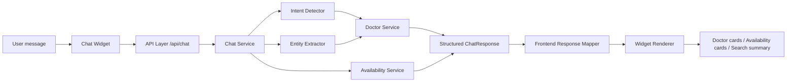
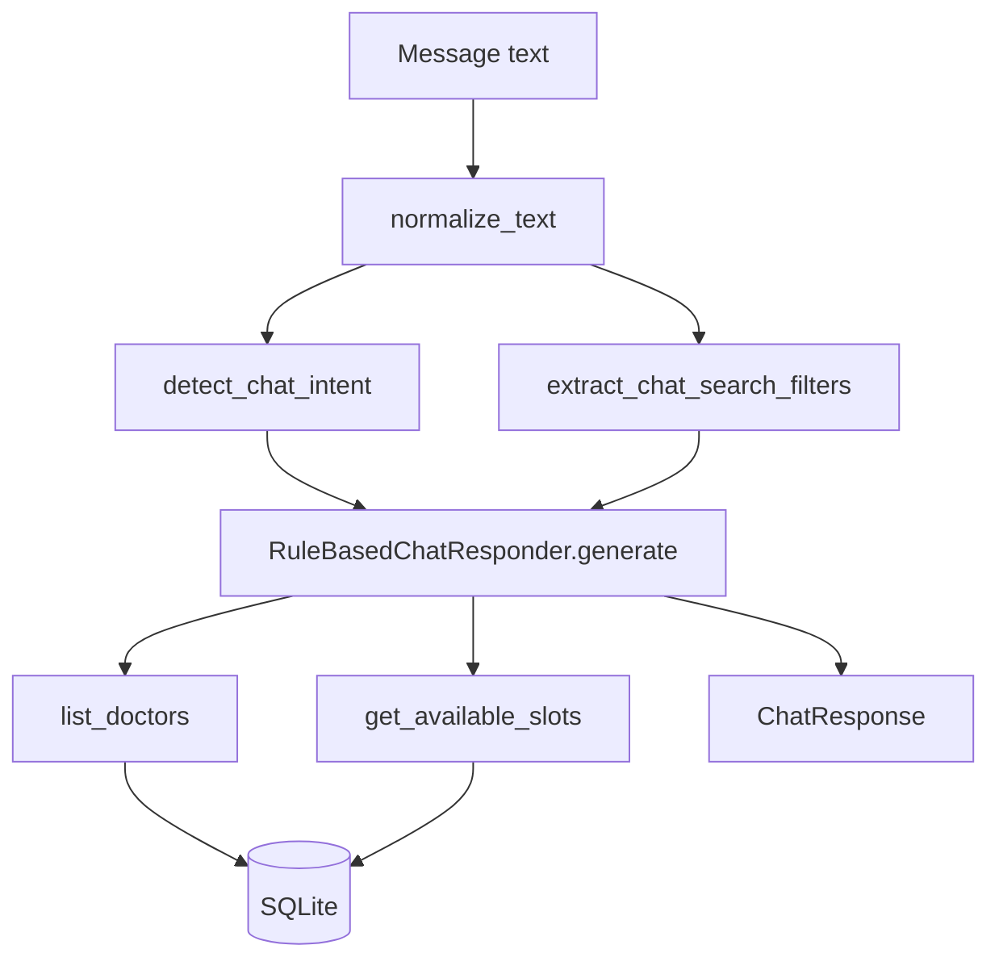
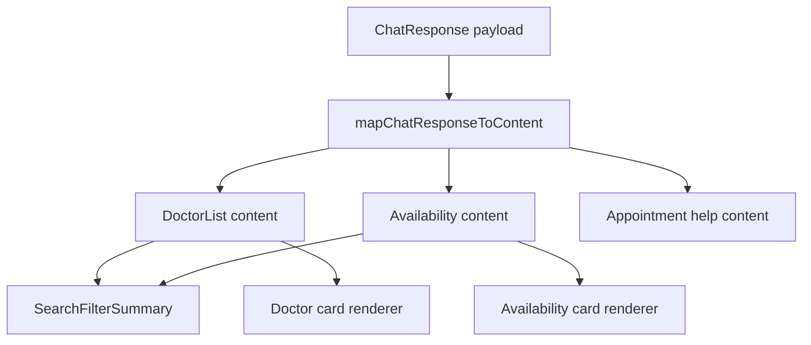

# Feature Report: AI Chat Phase 3 - Intent With Entity Extraction

## Executive Summary

Feature name:
AI Chat Phase 3, intent detection with entity extraction for doctor search and availability.

Business objective:
Turn a plain chat prompt into a structured doctor-discovery flow that can understand specialization, gender, fee range, location, date, and time preferences, then return actionable results the UI can render directly.

Major outcomes:
- The backend now parses natural language into structured search filters.
- The chat endpoint returns typed doctor cards and availability cards instead of plain text only.
- The frontend chat widget renders those structured responses as search summaries, doctor cards, availability cards, and appointment-help content.
- Time-based requests such as `Need appointment after 5 PM` now route to availability search instead of generic booking help.

User impact:
- Users can ask for doctors in natural language and get relevant results without manually setting filters.
- Users can combine multiple constraints in one message, such as specialization plus gender plus date.
- Users can search by time preference and only see slots that match the requested window.
- The experience feels like a guided assistant instead of a text-only chatbot.

---

## Feature Overview

### Problem

Before this phase, the assistant could not reliably convert natural language into structured doctor search intent. It also did not extract enough entities to support practical search requests such as:
- `Need a female cardiologist tomorrow`
- `Need doctor under ₹200`
- `Need pediatrician near London clinic`
- `Need appointment after 5 PM`

The result was a fragmented UX:
- Some queries returned generic help text.
- Some search details were lost.
- Availability requests were not consistently routed to the slot lookup flow.
- The frontend could not render a uniform structured experience.

### Solution

This phase introduced a deterministic backend parser and a structured frontend response mapper.

Backend responsibilities:
- Detect the chat intent.
- Extract entities from the message.
- Query doctors and availability from existing services.
- Return a normalized response shape with `intent`, `message`, `data`, `search_filters`, and legacy `response`.

Frontend responsibilities:
- Map the backend payload into typed widget content.
- Render doctor cards, availability cards, and search summaries.
- Keep the mock service aligned with backend behavior for local development.

### Result

The chat assistant now supports a complete search-to-action flow:
- Users describe what they need in plain language.
- The backend extracts filters and decides whether the message is a doctor search, availability search, doctor-details lookup, or appointment-help prompt.
- The frontend renders rich cards and filter chips.
- Time-based availability searches now work the same way as specialization and fee searches.

---

## Commit Analysis

### Commit 1

Commit Message:
`8779414a87a7e7c1ddda92de8776aeca7883acdd - Feature 9 | Enhanced Chat Window | Doctors Search BE/UI | prompt generation`

Purpose:
Defined the backend and frontend prompt contracts before implementation.

Files Modified:
- `docs/prompts/backend/feature-7-intent-with-entity-extraction/1-natural-language-doctor-search-prompt.md`
- `docs/prompts/frontend/feature-7-intent-with-entity-extraction/1-advanced-search-response-prompt.md`

Technical Impact:
- Established the expected behavior for intent detection and structured response rendering.
- Gave the implementation a deterministic target instead of an open-ended chat design.

Business Impact:
- Prevented the feature from becoming a generic chatbot.
- Made the assistant’s job explicit: understand search intent and return actionable doctor discovery results.

### Commit 2

Commit Message:
`f3d9c67c96e9b7886f89356c5f174c859894edbd - Feature 9 | Enhanced Chat Window | Doctors Search BE/UI | BE search update with entity extraction`

Purpose:
Built the backend entity extraction and search orchestration layer.

Files Modified:
- `backend/app/api/doctors.py`
- `backend/app/db/database.py`
- `backend/app/db/seed.py`
- `backend/app/models/doctor.py`
- `backend/app/repositories/doctor_repository.py`
- `backend/app/schemas/chat.py`
- `backend/app/schemas/doctor.py`
- `backend/app/services/chat_entity_extractor.py`
- `backend/app/services/chat_intent_detector.py`
- `backend/app/services/chat_service.py`
- `backend/app/services/doctor_service.py`
- `backend/tests/test_appointments_api.py`
- `backend/tests/test_availability_service.py`
- `backend/tests/test_chat_api.py`
- `backend/tests/test_chat_entity_extractor.py`
- `backend/tests/test_chat_intent_detector.py`
- `backend/tests/test_doctors_api.py`

Technical Impact:
- Added a standalone entity extractor for specialization, gender, fee, date, time preference, and clinic location.
- Expanded the chat schema to carry structured search filters.
- Taught the chat service to translate extracted filters into doctor and availability queries.
- Reused the existing SQLite-backed doctor and availability services instead of creating a new search system.

Business Impact:
- Enabled natural language search across the real doctor inventory.
- Supported practical user prompts that mix multiple constraints.
- Turned the assistant into a useful discovery layer instead of a text-only responder.

### Commit 3

Commit Message:
`8378c4e44fb8ba67c6e9bfa8f19377d66f677529 - Feature 9 | Enhanced Chat Window | Doctors Search BE/UI | FE layer syncing with BE response`

Purpose:
Aligned the frontend AI widget with the new backend response contract.

Files Modified:
- `backend/app.db`
- `frontend/lib/ai-widget/components/MessageContentRenderer.tsx`
- `frontend/lib/ai-widget/components/SearchFilterSummary.tsx`
- `frontend/lib/ai-widget/components/index.ts`
- `frontend/lib/ai-widget/services/chat-response-mapper.ts`
- `frontend/lib/ai-widget/services/mock-service.ts`
- `frontend/lib/ai-widget/types/chat.ts`
- `frontend/lib/ai-widget/types/message.ts`

Technical Impact:
- Added typed frontend models for structured chat responses.
- Added response mapping logic for doctor lists and availability cards.
- Added search filter summaries so the assistant can show what it understood.
- Updated the mock service so frontend development mirrors backend payloads.

Business Impact:
- Users can see what filters were extracted from their query.
- The assistant response becomes legible and actionable instead of a plain text blob.
- Frontend and backend now speak the same response language.

### Commit 4

Commit Message:
`39aa2a6828e1745585d1cc81d35cd54aba6ee026 - Feature 9 | Enhanced Chat Window | Doctors Search BE/UI | BE layer entity extracted againest time`

Purpose:
Fixed the routing gap for time-based appointment requests and aligned mock behavior with backend logic.

Files Modified:
- `backend/app/services/chat_intent_detector.py`
- `backend/tests/test_chat_api.py`
- `backend/tests/test_chat_intent_detector.py`
- `frontend/lib/ai-widget/services/mock-service.ts`

Technical Impact:
- Availability searches now win when a message contains a time preference or date, even if it also contains appointment-language keywords.
- Added test coverage for `Need appointment after 5 PM`.
- Updated the mock service to include time-aware search examples and evening slots.

Business Impact:
- Solved the exact gap where users asked for appointments after a specific time and the assistant responded with generic booking help.
- Made time-based doctor discovery work the same way as specialization, gender, and fee filters.

---

## Architecture Changes

### High-Level Flow



### Backend Flow



### Frontend Flow



### Database

- The feature continues to use the existing SQLite database.
- No schema migration was needed for the chat functionality.
- Doctor and availability data come from the pre-seeded data set.
- The chat service reads from the existing repository and availability service rather than duplicating persistence logic.

---

## Frontend Changes

### File: `frontend/lib/ai-widget/types/chat.ts`

Purpose:
Define the typed backend response contract for the widget.

Changes Introduced:
- Added typed chat response payloads for doctor cards and availability cards.
- Added structured search filter typing.

Reason For Change:
- The frontend needed to know exactly what the backend could return so it could render rich UI safely.

Before:
- The widget treated chat responses as mostly plain text.

After:
- The widget can distinguish doctor search results, availability results, and appointment-help messages.

Code Example:

```ts
export type AiWidgetChatSearchFilters = {
  specialization?: string;
  gender?: string;
  minimum_fee?: number;
  maximum_fee?: number;
  date?: string;
  time_preference?: string;
  clinic_location?: string;
};
```

Code Intent:
This type lets the frontend render the extracted filters as chips and summaries.

### File: `frontend/lib/ai-widget/services/chat-response-mapper.ts`

Purpose:
Convert backend payloads into UI-specific message content.

Changes Introduced:
- Added mapping for doctor list content.
- Added mapping for availability content.
- Added search summary generation from extracted filters.
- Added time filter chip rendering.

Reason For Change:
- The backend returns structured data, but the widget needs a presentation model.

Before:
- The widget could only show generic assistant text.

After:
- The widget renders doctor cards, availability cards, and search summaries with filter chips.

Code Example:

```ts
if (filters.time_preference) {
  chips.push({
    label: "Time",
    value: filters.time_preference,
  });
}
```

Code Intent:
This gives the user visible confirmation that the assistant understood the time requirement.

### File: `frontend/lib/ai-widget/components/SearchFilterSummary.tsx`

Purpose:
Show a compact summary of what the assistant extracted from the user query.

Changes Introduced:
- Added count label support.
- Added pill-like cards for each extracted filter.
- Styled the summary as a distinct UI block above the doctor/availability results.

Reason For Change:
- Users need to see what the assistant understood so they can trust the result set.

Before:
- Search results appeared without an explicit explanation of the interpreted filters.

After:
- The widget shows a result count plus readable chips for specialization, gender, fee, date, time, and location.

Code Example:

```tsx
{filters.map((filter) => (
  <div key={`${filter.label}-${filter.value}`}>
    <p>{filter.label}</p>
    <p>{filter.value}</p>
  </div>
))}
```

Code Intent:
This makes the search response legible and debuggable.

### File: `frontend/lib/ai-widget/components/MessageContentRenderer.tsx`

Purpose:
Choose the correct UI component for each structured assistant response.

Changes Introduced:
- Routed `doctor_list`, `availability`, and `appointment_help` content to dedicated renderers.

Reason For Change:
- Different backend intents should not all render as plain text.

Before:
- Responses were rendered using a generic fallback.

After:
- Doctor search, availability search, and appointment help each use the appropriate UI treatment.

Code Example:

```tsx
switch (content.type) {
  case "doctor_list":
  case "availability":
  case "appointment_help":
```

Code Intent:
This keeps the widget extensible as more assistant response types are added.

### File: `frontend/lib/ai-widget/services/mock-service.ts`

Purpose:
Keep local frontend development behavior aligned with the backend response contract.

Changes Introduced:
- Added a time-aware mock rule for `after 5 pm`.
- Reordered mock matching so availability wins before generic appointment help.
- Added evening slot examples in the mocked payload.

Reason For Change:
- The UI should demonstrate the same behavior developers get from the backend.

Before:
- The mock service did not reliably simulate time-filtered availability searches.

After:
- The mock service returns a structured availability response with `time_preference: "After 5:00 PM"`.

Code Example:

```ts
test: (message) =>
  message.includes("available") ||
  message.includes("tomorrow") ||
  message.includes("schedule") ||
  message.includes("after 5 pm") ||
  message.includes("after 5pm"),
```

Code Intent:
This ensures a user can test the new time-based search path without needing backend calls.

---

## Backend Changes

### File: `backend/app/services/chat_entity_extractor.py`

Purpose:
Extract structured search entities from a natural language chat message.

Changes Introduced:
- Specialization alias mapping.
- Gender detection.
- Fee range parsing.
- Date parsing.
- Time preference parsing.
- Clinic location parsing.

Reason For Change:
- The backend needed a reusable parser that can understand natural language doctor search terms.

Code Example:

```py
return ChatSearchFilters(
    specialization=extract_specialization(normalized_message),
    gender=extract_gender(normalized_message),
    minimum_fee=minimum_fee,
    maximum_fee=maximum_fee,
    date=extract_target_date(normalized_message),
    time_preference=extract_time_preference(normalized_message),
    clinic_location=extract_clinic_location(normalized_message),
)
```

Code Intent:
This creates one structured filter object that downstream logic can use for both doctor search and availability search.

Business Requirement:
Support prompts like:
- `Need female cardiologist tomorrow`
- `Need doctor under ₹200`
- `Need pediatrician near London clinic`
- `Need appointment after 5 PM`

Technical Benefit:
Entity extraction is centralized, testable, and reusable.

### File: `backend/app/services/chat_intent_detector.py`

Purpose:
Decide which search mode a message belongs to.

Changes Introduced:
- Added awareness of time/date entities.
- Updated routing so time-based appointment requests become availability searches.

Reason For Change:
- A message can contain appointment language and still be a slot search.

Code Example:

```py
if any(keyword in normalized_message for keyword in APPOINTMENT_HELP_KEYWORDS):
    if intent_match.target_date is not None or intent_match.time_preference is not None:
        return ChatIntentMatch(
            intent=ChatIntent.SHOW_AVAILABLE_DOCTORS,
            target_date=intent_match.target_date,
            time_preference=intent_match.time_preference,
        )
```

Code Intent:
This avoids misclassifying `Need appointment after 5 PM` as generic booking help.

Business Requirement:
Users asking for appointments at a specific time need availability results, not instructions.

Technical Benefit:
Intent routing now reflects the semantic priority of date/time constraints.

### File: `backend/app/services/chat_service.py`

Purpose:
Orchestrate the full chat response flow.

Changes Introduced:
- Detect intent.
- Extract search filters.
- Route to doctor discovery, availability, details, or appointment help.
- Filter availability by time preference before returning results.

Reason For Change:
- The chat response had to become an application flow, not just a parser.

Code Example:

```py
if intent_match.intent == ChatIntent.SHOW_AVAILABLE_DOCTORS or search_filters.date is not None or search_filters.time_preference is not None:
    return self._respond_with_availability(message, intent_match, search_filters, doctors)
```

Code Intent:
This ensures time-based and date-based messages go through the availability path even when the user phrase includes appointment language.

Business Requirement:
Return only slots that fit the user’s requested time window.

Technical Benefit:
The service layer now enforces business rules consistently before constructing the response payload.

### File: `backend/app/schemas/chat.py`

Purpose:
Define the chat API response contract.

Changes Introduced:
- Added `time_preference` and `clinic_location` to `ChatSearchFilters`.
- Preserved the legacy `response` field for backward compatibility.

Reason For Change:
- The API needed to carry all extracted entities back to the frontend.

Code Example:

```py
class ChatSearchFilters(BaseModel):
    specialization: str | None = None
    gender: str | None = None
    minimum_fee: int | None = None
    maximum_fee: int | None = None
    date: Date | None = None
    time_preference: str | None = None
    clinic_location: str | None = None
```

Code Intent:
This schema makes the assistant response explicit and future-proof.

### File: `backend/app/api/doctors.py`

Purpose:
Expose the existing doctor listing and doctor detail endpoints used by the booking flow.

Changes Introduced:
- Exposed filterable doctor listing with specialty, appointment type, gender, location, and fee range query parameters.

Reason For Change:
- The chat and booking flows both depend on a single source of truth for doctor records.

Code Example:

```py
@router.get("", response_model=DoctorListResponse)
def read_doctors(
    specialty: str | None = Query(default=None),
    appointment_type: AppointmentType | None = Query(default=None),
    gender: str | None = Query(default=None),
```

Code Intent:
This keeps the doctor search API reusable across the app.

### File: `backend/app/services/doctor_service.py`

Purpose:
Convert ORM doctors into API responses and apply filter input normalization.

Changes Introduced:
- Normalized specialty input before repository lookup.
- Reused repository filtering for chat-driven and page-driven doctor lookup.

Reason For Change:
- The chat layer should not duplicate filtering logic that already belongs in the doctor service.

Code Example:

```py
specialty_value = specialty.strip() if specialty else None
doctors = get_doctors_by_filters(
    session,
    specialty=specialty_value,
```

Code Intent:
This keeps the doctor search path consistent regardless of where the query originated.

### File: `backend/app/repositories/doctor_repository.py`

Purpose:
Apply the actual database filters against SQLite.

Changes Introduced:
- Added filtering for gender, location, and fee range using SQLAlchemy.

Reason For Change:
- The backend needed data-layer support for the new chat filters.

Code Example:

```py
if location:
    location_value = location.strip()
    statement = statement.where(
        or_(
            Doctor.location.ilike(f"%{location_value}%"),
            Doctor.clinic_name.ilike(f"%{location_value}%"),
        )
    )
```

Code Intent:
This makes location-based prompts like `near London clinic` meaningful against the stored data.

### File: `backend/tests/test_chat_api.py`

Purpose:
Verify the full chat API response contract.

Changes Introduced:
- Added coverage for specialty searches.
- Added coverage for filtered availability searches.
- Added coverage for time-filtered availability searches.
- Added coverage for doctor details and appointment help responses.

Reason For Change:
- The feature needed regression protection for the new structured behavior.

Code Example:

```py
response = client.post("/api/chat", json={"message": "Need appointment after 5 PM"})

assert payload["intent"] == ChatIntent.SHOW_AVAILABLE_DOCTORS.value
assert payload["search_filters"]["time_preference"] == "After 5:00 PM"
```

Code Intent:
This test locks the fix in place so time-based appointment requests keep routing to availability search.

---

## API Changes

### Endpoint

`POST /api/chat`

Compatibility:
- The service also supports `/api/v1/chat` through the existing router wiring.

### Request

```json
{
  "message": "Need female cardiologist tomorrow"
}
```

### Response

```json
{
  "intent": "SHOW_AVAILABLE_DOCTORS",
  "message": "Found 6 available slots for Dr. Sarah Jenkins on 2026-06-22.",
  "response": "Found 6 available slots for Dr. Sarah Jenkins on 2026-06-22.",
  "search_filters": {
    "specialization": "Cardiology",
    "gender": "Female",
    "date": "2026-06-22",
    "time_preference": "After 5:00 PM"
  },
  "data": [
    {
      "doctor_id": 1,
      "doctor_name": "Dr. Sarah Jenkins",
      "specialty": "Cardiology",
      "available_date": "2026-06-22",
      "available_time": "18:00"
    }
  ]
}
```

### New Fields

- `search_filters.time_preference`
- `search_filters.clinic_location`
- `data[]` can now contain either doctor cards or availability cards depending on intent.
- `search_filters.clinic_location` appears when the query mentions a place such as a clinic, city, or neighborhood.

### Updated Fields

- `intent` now distinguishes availability search from appointment-help messages more precisely.
- `response` mirrors `message` for backward compatibility.
- `data` is now structured content rather than generic text.

### Validation

- Blank messages are rejected with HTTP 422.
- `message` must be a non-empty string with a maximum length of 1000 characters.

### Example Cases

- `Need a cardiologist` → specialization search
- `Need female cardiologist` → specialization + gender search
- `Need dermatologist tomorrow` → availability search with target date
- `Need doctor under ₹200` → fee filter search
- `Need pediatrician near London clinic` → specialization + location search
- `Need appointment after 5 PM` → availability search with time filter

---

## Detailed Code Change Analysis

### Change

Introduced a dedicated entity extractor.

### Intent

Convert one free-form chat message into a structured filter object.

### Business Need

Users describe doctor searches in natural language, not in form fields.

### Technical Benefit

The extractor creates one deterministic parsing layer that all downstream modules can use.

### Example

```py
def extract_time_preference(normalized_message: str) -> str | None:
    for keyword, label in _TIME_OF_DAY_WINDOWS.items():
        if keyword in normalized_message:
            return label
```

### Change

Updated intent detection to prioritize time/date-driven availability searches.

### Intent

Avoid sending a slot request to generic appointment help.

### Business Need

Users asking for `after 5 PM` want available slots, not instructions.

### Technical Benefit

The routing logic now matches user intent more closely and prevents dead-end responses.

### Example

```py
if intent_match.intent == ChatIntent.SHOW_AVAILABLE_DOCTORS or search_filters.date is not None or search_filters.time_preference is not None:
    return self._respond_with_availability(message, intent_match, search_filters, doctors)
```

### Change

Added structured frontend rendering for chat responses.

### Intent

Turn backend data into readable widget components.

### Business Need

The assistant must show the extracted filters and results in a way users can act on immediately.

### Technical Benefit

Presentation logic stays in the frontend, while business logic stays in the backend.

### Example

```tsx
case "SHOW_AVAILABLE_DOCTORS":
  return createAvailabilityContent(payload);
```

### Change

Aligned the mock service with the backend contract.

### Intent

Keep local development and backend behavior in sync.

### Business Need

Developers need the frontend to demonstrate the same assistant behavior even when the backend is not running.

### Technical Benefit

The mock service now protects the UI contract from drift.

### Example

```ts
message.includes("after 5 pm") ||
message.includes("after 5pm")
```

---

## Data Flow

```text
User query
  → Intent Detection
  → Entity Extraction
  → Doctor Service
  → Availability Service
  → Structured Response
  → Chat Widget Rendering
```

### Expanded Flow

1. The user types a message in the chat widget.
2. The backend normalizes the text.
3. The intent detector classifies the request.
4. The entity extractor builds `ChatSearchFilters`.
5. The service layer decides whether to search doctors, fetch availability, or show appointment help.
6. Doctor and slot data are fetched from the existing SQLite-backed services.
7. A structured `ChatResponse` is returned.
8. The frontend maps the payload into card-based UI.
9. Search filters are displayed as chips so the result is explainable.

### Time-Based Query Example

For `Need appointment after 5 PM`:
- `extract_time_preference()` returns `After 5:00 PM`
- `detect_chat_intent()` routes the request to availability search
- `chat_service.py` filters slots to the evening window
- The widget renders only slots that satisfy the time preference

---

## Business Outcome Summary

This phase turns the assistant into a practical doctor discovery tool.

It solves three concrete business problems:
- Search friction: users no longer need to manually set every filter.
- Routing ambiguity: time/date appointment requests now get availability results.
- Response usability: the UI can render structured, actionable cards instead of plain text.

The result is a chat workflow that is consistent, testable, and ready for incremental expansion.
